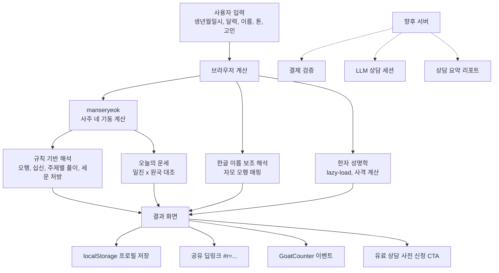

# Saajuu 과제 현황 / 핸드오프 문서

마지막 정리일: 2026-07-11 KST (v0.5.9.0 작업 반영, Codex 인계용)
현재 목적: 사주 기반 정적 PoC를 수익화 가능한 개인 맞춤 상담 서비스로 고도화

이 문서는 도구(Claude Code, Codex 등)에 무관하게 이 저장소에서 작업을 이어받는
누구나 첫 번째로 읽어야 하는 파일이다. 로컬 전용 경로(예: 다른 도구의 세션
디렉토리)를 참조하지 않고, 필요한 결정 근거를 전부 이 파일과 리포 안에 담는다.

## 바로 볼 것

- 배포 페이지: https://lee9387-hm.github.io/Saajuu/
- GitHub 저장소: https://github.com/LEE9387-HM/Saajuu
- 현재 브랜치: `main`
- 최신 커밋: 이 문서가 포함된 v0.5.9.0 커밋
- 현재 버전: `0.5.9.0` (`VERSION`, `package.json` 동일)
- 수익화 계획: `docs/monetization-plan.md`
- 점신 벤치마크: `docs/01_JEOMSIN_BENCHMARK.md`
- 무료 콘텐츠 명세: `docs/02_FREE_CONTENT_SPEC.md`
- AI 페르소나/프로 모드: `docs/03_AI_PERSONAS_AND_PRO_MODE.md`
- 상담 전환 퍼널: `docs/04_CONSULTATION_FUNNEL.md`
- 서버·개인정보·결제 기준: `docs/05_ARCHITECTURE_PRIVACY_PAYMENT.md`
- 구현 로드맵: `docs/06_IMPLEMENTATION_ROADMAP.md`
- 디자인 시스템: `DESIGN.md`
- 보류 작업(착수 조건 포함): `TODOS.md`
- 변경 이력: `CHANGELOG.md`

## 현재 상태 (v0.5.9.0)

Saajuu는 Vite 기반 정적 웹앱이다. GitHub Actions가 `main` 푸시마다 테스트·빌드 후
GitHub Pages에 자동 배포한다. 서버·DB·로그인은 없다. 모든 계산은 브라우저에서
실행되고, 개인정보는 사용자 기기(localStorage)에만 저장된다.

구현된 기능:

- **사주 계산**: 양력·음력·윤달, 0~59분 단위 출생시각 → 연·월·일·시주, 오행 분포
- **주제별 풀이 6종**: 궁합·연애 / 결혼운 / 사업운 / 직업·이직운 / 가족·자녀운 /
  신년·월간운 — 전부 한 줄 결론(`verdict`)이 카드 최상단에 오도록 카피 재작성 완료
- **오늘의 처방(`buildGuidance`)**: 올해 세운(2026 병오년 등)과 원국을 대조해
  "가까이할 것 / 조심할 것" 3개씩 생성
- **오늘의 운세(일일 운세, v0.5.2)**: 일진 60갑자와 원국을 대조한 매일 다른 개인화
  운세. 한 줄 결론, 총점, 일·관계·금전·생활 점수, 시간대별 흐름, 조심할 것,
  행운 숫자·색·방향·음식·아이템, 오늘의 행동, 상담 연결 질문을 제공. 십신 10종 ×
  지지 관계 5분류 조합으로 60일 주기 순환 — 자세한 알고리즘은 아래 "일일 운세 알고리즘" 참조
- **프로필 저장(v0.4.0)**: localStorage 단일 프로필. 재방문 시 오늘의 운세를 폼보다
  먼저 렌더. "정보 수정" / "저장 정보 삭제" 버튼
- **결과 공유 딥링크(v0.4.1)**: `#r=` 해시로 생년월일시·달력·주제만 인코딩(이름·
  고민·톤 절대 미포함). 일회성 렌더, 저장 프로필 비파괴, "내 사주로 돌아가기"
- **사주 카드 이미지 저장**: canvas로 카드 PNG 생성, Web Share/다운로드
- **한글 이름 성명학 맛보기**: 한글 자모를 오행으로 변환하는 보조 해석 (기본,
  항상 표시)
- **한자 성명학 정밀 풀이(v0.5.0)**: 대법원 인명용 한자(약 9,500자)로 각 글자의
  한자를 선택하면 원형이정(元亨利貞) 사격 + 81수리 길흉을 계산. 성명학 섹션의
  "한자 이름으로 정밀 사격 풀이" 버튼 클릭 시 데이터 lazy-load
- **GoatCounter 계측**: 사이트 코드 `fortune9388` 활성화됨. 이벤트: `premium-interest`,
  `card-save`, `daily-view`, `share-link`, `share-open`, `hanja-open`, `hanja-reading`
- **유료 상담 사전 신청**: "상담 오픈되면 알려주세요" 버튼(수요 신호 계측용, 결제
  기능 없음)
- **모바일 정보구조(v0.5.1)**: 오늘 / 내 사주 / 올해 / 인연 / 타로 / 상담 / 마이
  앵커 내비게이션과 무료 콘텐츠 허브. 기존 계산 흐름은 유지하고, 아직 구현 전인 기능은
  정적 안내 카드로 노출
- **1회성 인연·궁합(v0.5.3)**: 인연 탭에서 상대 1명을 저장 없이 입력해 관계 유형별
  궁합 점수, 잘 맞는 점, 부딪히는 점, 먼저 꺼낼 대화, 상담 연결 질문을 계산한다.
  로그인 후 공유 초대로 친구처럼 묶는 구조는 서버/계정/동의 로그가 준비된 뒤 착수한다.
- **상담사 3인 UI와 프로 모드 안내(v0.5.4)**: AI 상담 탭에서 미선 이모, 준호 형,
  성우 선생의 말투·상담 분야·샘플 톤을 보여주고, 고민 주제별 추천 상담사 2명을
  표시한다. 무료 체험/기본 상담/프로 상담은 별도 모드 카드로 분리해 성능 등급과
  페르소나가 섞이지 않게 했다.
- **Supabase 서버 계층 기준선(v0.5.5)**: Supabase 프로젝트 `eizojtispxmlwvhgpmgs`
  기준으로 계정, 동의, 출생정보, 인연 초대/연결, 상담사/상품 카탈로그, 주문, 이용권,
  상담 세션, 메시지, 요약, 안전 이벤트, 광고 보상, 분석 이벤트의 초기 DB 마이그레이션
  초안을 추가했다. 원격 DB에는 아직 적용하지 않았고, 개인정보/동의 문구와 Edge Function
  경계 확정 후 advisor/RLS 검토를 거쳐 적용한다.
- **Supabase Auth 시작점(v0.5.6)**: `.env`의 `VITE_SUPABASE_URL`과
  `VITE_SUPABASE_PUBLISHABLE_KEY` 또는 `VITE_SUPABASE_ANON_KEY`를 사용해 마이 영역에서
  카카오/Google OAuth 로그인을 시작할 수 있다. 현재는 세션 표시와 로그아웃까지이며,
  프로필 DB 생성, 인연 초대 수락, 상담 세션 생성은 DB 적용 후 진행한다.
- **로그인 프로필 동기화 준비(v0.5.7)**: 로그인 세션이 생기면 `profiles` 테이블에
  사용자 id와 표시 이름을 upsert한다. OAuth metadata는 표시용으로만 쓰며 권한 판단에는
  사용하지 않는다. 원격 DB 마이그레이션이 적용되지 않았을 때는 로그인 상태를 유지하고
  프로필 저장 대기 안내만 표시한다.
- **Supabase 원격 DB 적용(v0.5.8)**: 초기 수익화 스키마와 advisor 보강 마이그레이션을
  Supabase 프로젝트 `eizojtispxmlwvhgpmgs`에 적용했다. `npx supabase db advisors --linked
  --type all --level warn --fail-on none` 결과는 `No issues found`다.
- **필수 동의 기록(v0.5.9)**: 로그인한 사용자에게 서비스 이용약관, 개인정보 처리방침,
  AI 상담/오락·자기성찰 목적 고지 확인 폼을 표시하고 `consent_logs`에 동의 로그를 저장한다.
  저장된 현재 버전 동의는 다시 불러와 체크 상태로 표시한다.
- **수익화 기준 문서(v0.5.1)**: GPT 챗의 점신 벤치마크, 무료 콘텐츠 강화, 3인 AI
  페르소나, 프로 모드, 상담 퍼널, 서버/결제/개인정보 기준을 `docs/01~06_*.md`로 분리

## 제품 방향 (바뀌지 않은 핵심 가설)

"사주는 예언 앱이 아니라 심리 상담과 유사한 자기 이해/상담 UX"라는 가설로 간다.
결과 화면은 항상:

- 사용자의 불안·고민을 받아주는 톤(단정 예언 금지 — "반드시 ~된다" 대신 "~하기
  좋은 날/흐름")
- **한 줄 결론이 카드 최상단** — "~가 아닙니다"로 시작하는 방어적 문장 금지
  (v0.4.0에서 전면 재작성 완료. 새 카드를 추가할 때도 이 규칙을 지킬 것)
- 실제 궁합·결혼·사업운처럼 사람들이 검색하는 키워드에 명쾌하게 답함
- 사주 근거(일간·오행·십신·세운)를 evidence 칩으로 항상 노출

## GPT 챗 수익화 계획 반영 기준 (2026-07-11)

ChatGPT 대화에서 정리한 점신 벤치마킹, 무료 콘텐츠 강화, AI 상담 페르소나,
프로 모드, 광고 보상, 상담 전환 퍼널은 별도 기준 문서로 분리했다.

반드시 반영해야 할 새 기준:

- 점신 캡처 38장은 공개 저장소에 커밋하지 않고 구조만 문서화한다.
- 무료 콘텐츠는 `오늘 / 내 사주 / 올해의 흐름 / 인연 / 타로·테스트 / 상담 / 마이`
  허브로 확장한다.
- 오늘의 운세는 총점, 시간대, 분야별 점수, 행운 아이템, 상담 연결 질문으로 확장한다.
- 다중 프로필은 아직 보류지만, 1회성 인연/궁합 입력은 핵심 전략이라 먼저 검증한다.
- AI 상담사는 `미선 이모`, `준호 형/오빠`, `성우 선생` 3인 페르소나로 설계한다.
- 상담사 선택과 상품 등급은 분리한다. 페르소나는 `누구와 이야기할지`, 프로 모드는
  `얼마나 깊게 분석할지`다.
- 광고는 무료 상세/체험 보상에만 제한하고, 입력 화면·로그인 화면·상담 화면·유료 화면에는
  넣지 않는다.
- 서버/LLM/결제는 개인정보처리방침, 동의 기록, 삭제/보관 정책, 결제 검증 설계와 함께
  시작한다.

## 일일 운세 알고리즘 (`src/daily.js`)

1. `calculateFourPillars(오늘 로컬 날짜, 12:00)` → 오늘의 일진 천간·지지
   (자시 경계는 의도적으로 무시, 날짜 키는 로컬 `getFullYear/Month/Date` 사용 —
   `toISOString`은 UTC라서 금지)
2. **메시지 축**: ① `getTenGod(사용자 일간, 일진 천간)` → 십신 10종 기본 메시지
   ② 일진 지지 vs 사용자 일지의 관계 → 5분류(충/형/육합/반합/없음)로 보정 문장 추가.
   지지 관계는 **배타 분류가 아니라 다중 관계**이므로 우선순위(충 > 형 > 육합 > 반합)를
   `getBranchRelation`에 12×12 완전 테이블로 확정해 두었다. 진·오·유·해 동일 지지는
   자형(형)으로 처리. 이 조합으로 실질 60갑자 주기가 만들어진다
3. **행운 오행**: 일진 천간 오행 == 사용자 원국의 강한 오행 → 그 오행이 생(生)하는
   오행(설기), 그 외 → 원국의 부족 오행
4. **행운 숫자**: 목3·8 화2·7 토5·10 금4·9 수1·6 — 일진 지지 인덱스 홀짝으로 주/보조
   숫자 결정
5. **행운 색**: `ELEMENT_PRESCRIPTION.color` 재사용 (기존 처방 모듈과 동일 어휘)
6. **보고서 확장(v0.5.2)**: 십신별 기본 점수와 지지 관계 보정으로 총점·분야별 점수·
   시간대별 흐름을 만들고, 행운 오행으로 방향·음식·아이템을 결정한다. 상담 연결 질문은
   지지 관계(충/형/육합/반합/없음)에 따라 달라진다
7. 상생 맵(`ELEMENT_GENERATES`)은 `manseryeok`이 루트로 export하지 않아 자체 정의함
   (deep import 금지, `daily.test.js`에서 라이브러리 상수와 대조 검증)

## 한자 성명학 (`src/name-hanja.js`, `scripts/build-hanja-db.mjs`)

- 데이터 출처: [delvier/krcourt](https://github.com/delvier/krcourt)의
  `webhanja.db`(대법원 인명용 한자 SQLite, master 브랜치 아님 — **`main` 브랜치의
  파일을 받아야 함**, master는 HTML 리다이렉트 페이지가 내려온다)
- 저작권: 대법원 인명용 한자표는 법령·국가 편집물이므로 저작권법 제7조 제1호·
  제4호에 따라 보호 대상 아님(`scripts/build-hanja-db.mjs` 주석에 근거 명시,
  korean-law MCP로 조문 원문 확인함)
- 원획 계산: 강희 214부수의 본자 획수 구간표 + `rad_stroke.stroke`(부수 제외
  나머지 획) 합산. 부수 변형(氵→水4 등)은 `rad_id`가 본자 기준이라 자동 보정됨.
  숫자 한자(一~十)만 필획이 아니라 수의(數意) 획으로 덮어씀
- 재생성 방법:
  ```bash
  curl -sL -o /tmp/webhanja.db https://github.com/delvier/krcourt/raw/main/webhanja.db
  node scripts/build-hanja-db.mjs /tmp/webhanja.db
  # → src/data/name-hanja.json 재생성 (음절 490개, 항목 10,381개)
  ```
- 사격: 원격(元)=이름 획수 합 / 형격(亨)=성+이름 첫 자 / 이격(利)=성+이름 끝 자 /
  정격(貞)=전체 합. 외자는 이격=형격과 같음(UI에 고지). 복성은 두 글자 획수 합.
  81수리는 80 초과 시 -80으로 순환(`normalize81`). **81수리 길흉 분류는 유파 차이가
  있어 결과 화면에 항상 참고용 고지 문구를 붙인다**

## 아키텍처



서버가 필요해지는 시점은 유료화(결제, LLM 상담) 단계뿐이다. 그 전까지는 정적
배포를 유지한다. 무료 API나 LLM 키를 프런트에 직접 넣지 않는다 — 키 노출,
생년월일/이름/고민 같은 개인정보 노출, 유료 결제 검증 불가 문제가 생긴다.
붙일 때는 `브라우저 → 서버 함수 → 외부 API/LLM → 서버 후처리 → 브라우저` 형태로.

## 실행·검증·배포

```bash
npm install
npm run dev      # http://localhost:5173/ (launch.json에서 포트를 바꿔 쓰기도 함)
npm test         # vitest, 현재 52개 통과
npm run build    # dist/ 생성, 사이즈 확인
```

`main`에 푸시하면 `.github/workflows/deploy-pages.yml`이 `npm ci → npm test →
npm run build → GitHub Pages 배포` 순으로 자동 실행된다. 저장소
**Settings → Pages → Source = GitHub Actions**로 설정되어 있어야 한다.

배포 후 확인:
```
https://github.com/LEE9387-HM/Saajuu/actions
https://lee9387-hm.github.io/Saajuu/
```

## 주요 파일

| 파일 | 역할 |
|---|---|
| `index.html` | 입력 폼, 결과 섹션, 일일 운세 카드, 한자 성명학 패널, 공유 배너 |
| `src/fortune.js` | 사주 계산, 주제별 풀이(verdict 포함), 세운 처방(`buildGuidance`), 한글 이름 보조 해석 |
| `src/daily.js` | 일일 운세 엔진 — 지지 관계 테이블, 십신 메시지, 행운 오행/숫자/색 |
| `src/storage.js` | localStorage 프로필 저장/복원/삭제, 손상 데이터 격리 |
| `src/share.js` | 공유 딥링크 해시 인코딩/디코딩 |
| `src/track.js` | GoatCounter 계측 래퍼 (미설정 시 no-op) |
| `src/name-hanja.js` | 사격(원형이정) 계산, 81수리 길흉 |
| `src/data/name-hanja.json` | 인명용 한자 데이터 (lazy-load, 444KB) |
| `scripts/build-hanja-db.mjs` | krcourt SQLite → 위 JSON 변환 스크립트 |
| `src/main.js` | 폼 이벤트, 전체 렌더링 오케스트레이션, HTML 이스케이프 |
| `src/styles.css` | 전체 UI. 색·타이포 토큰은 `DESIGN.md` 참조 |
| `src/*.test.js` | 각 모듈별 vitest 테스트 (총 52개) |
| `vite.config.js` | GitHub Pages 경로 대응 `base: "./"` |
| `.github/workflows/deploy-pages.yml` | 자동 배포 워크플로 |
| `docs/monetization-plan.md` | 수익화 마스터 플랜 (가격, 로드맵, 경쟁 분석) |
| `DESIGN.md` | 색 토큰, 타이포, 컴포넌트 어휘, 카피 규칙, 금지 패턴 |
| `TODOS.md` | 보류된 작업과 착수 조건 (아래 참조) |

## 보류된 작업 (지금 착수하지 말 것 — `TODOS.md` 참조)

세 항목 모두 **코드 작업이 아니라 데이터·의사결정 게이트**로 막혀 있다. 게이트가
안 풀렸는데 구현부터 하면 "측정 먼저, 짓기는 나중"이라는 v0.4 설계 원칙을 어기게
된다.

| 항목 | 막힌 이유 | 풀리는 신호 |
|---|---|---|
| PWA (manifest/SW) | 카카오톡 인앱 브라우저 설치 불가, iOS 설치 프롬프트 없음 — 딥링크 유입과 상충 | GoatCounter 재방문율 데이터가 쌓이면 manifest만 먼저 |
| 띠별 운세 SEO 정적 페이지 | 애드센스는 `github.io` 서브도메인 등록 불가 | 커스텀 도메인 구매(연 ~2만 원) 결정 |
| 다중 프로필(가족 사주) | 단일 프로필은 "지인 사주 대신 보기" 패턴과 충돌 | GoatCounter에서 "정보 수정" 클릭 빈도가 높게 나오면 |

## 다음 단계 후보 (게이트 걸리지 않은 것부터)

1. **모바일 정보구조와 무료 허브** — 오늘/내 사주/올해/인연/타로/상담/마이 구조를
   잡되, 기존 사주 계산 흐름은 보존한다.
2. **오늘의 운세 보고서 확장** — `src/daily.js`를 재사용해 총점, 시간대별 흐름,
   일·관계·금전·생활 점수, 행운 아이템, 상담 연결 질문을 추가한다.
3. **1회성 인연·궁합** — 다중 프로필 없이 상대 1명 입력, 궁합 점수, 잘 맞는 점,
   충돌점, 상담 CTA를 검증한다.
4. **상담사 3인 UI와 프로 모드 안내** — 미선 이모, 준호 형/오빠, 성우 선생 카드와
   기본/프로 상담 차이를 노출한다.
5. **유료화 서버 계층 설계** — Supabase Edge Functions/Vercel Functions/Cloudflare
   Workers 중 택1. API 키 보호, LLM 호출 프록시, 상담 기록 저장 구조 설계
6. **유료 상담 MVP** — 10분/30분 상담, 상담 후 요약 리포트, 결제 성공 시 세션 활성화
7. **분석 고도화** — GoatCounter 이벤트를 보고 주제 선택 분포, 재방문 패턴 파악 →
   위 "보류된 작업" 게이트 판단에 사용

## 안전/법적 가드레일 (반드시 유지)

- 의료·정신건강·법률·투자·임신출산 판단을 대체하지 않는다는 문구를 결과 화면에
  유지할 것 (`index.html`의 `.disclaimer`)
- 단정적 예언 금지: "무조건 결혼한다/못 한다", "아이를 낳는다", "투자하면 돈 번다"
  같은 표현 쓰지 않기
- 한자 데이터·81수리 해석에 "유파에 따라 차이가 있다"는 고지를 항상 유지
- 공유 딥링크에 이름·고민·톤을 절대 넣지 않기 (개인정보 최소화 설계)
- 생년월일시 등 개인정보는 여전히 서버로 전송하지 않는다 — 이 원칙을 깨는 변경
  (서버 API 추가 등)은 사용자 고지와 개인정보처리방침 정비를 반드시 동반할 것

## 새로 이어받을 때 체크리스트

1. 이 파일을 읽는다.
2. `npm install && npm test && npm run build`로 현재 상태가 깨지지 않았는지 확인.
3. `npm run dev` 후 로컬에서 폼 제출 → 오늘의 운세 카드 → 한자 성명학 버튼까지
   한 번 눌러본다.
4. 새 작업이 "보류된 작업" 표의 항목이면, 먼저 게이트가 풀렸는지(사용자에게 직접
   확인) 검증한다.
5. 서버/LLM/결제 작업을 시작하기 전에는 API 키를 절대 프런트 코드에 넣지 않는다.
6. 커밋 후 `git push origin main` → GitHub Actions 성공 확인 →
   `CHANGELOG.md`/`VERSION`/이 파일 갱신.
