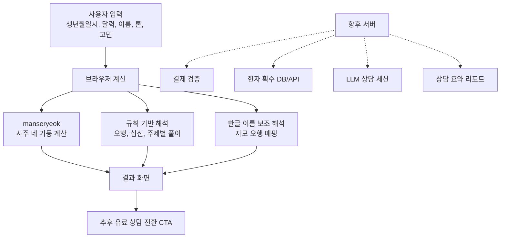

# Saajuu 과제 현황 README

마지막 정리일: 2026-07-08 KST (v0.3.0.0 작업 반영)  
현재 목적: 사주 기반 정적 PoC를 수익화 가능한 개인 맞춤 상담 서비스로 고도화

## 바로 볼 것

- 배포 페이지: https://lee9387-hm.github.io/Saajuu/
- GitHub 저장소: https://github.com/LEE9387-HM/Saajuu
- 현재 브랜치: `main`
- 최근 커밋: `4194240 개인화 사주 서비스 고도화`
- 핵심 기획 문서: `docs/monetization-plan.md`
- 원본/중간 백업:
  - `docs/monetization-plan.original-2026-07-07.md`
  - `docs/monetization-plan.before-content-upgrade-2026-07-07.md`
  - `docs/monetization-plan.before-plan-upgrade-2026-07-07.md`

## 현재 상태

Saajuu는 Vite 기반 정적 웹앱이다. 생년월일시를 입력하면 `manseryeok` 라이브러리로 사주 네 기둥과 오행 분포를 계산하고, 규칙 기반 풀이를 제공한다.

현재 버전은 단순 계산기를 넘어 다음 흐름까지 들어가 있다.

- 주제별 풀이: 궁합·연애, 결혼운, 사업운, 직업·이직운, 가족·자녀운, 신년·월간운
- 개인화 입력: 이름, 풀이 톤, 현재 고민 한 줄
- 성명학 맛보기: 한글 이름 자모를 오행 흐름으로 변환해 사주와 함께 보조 해석
- 상담 노트: 사주, 주제, 이름, 고민, 톤을 묶어 개인 맞춤 상담처럼 읽히는 섹션
- 30분 상담 확장 구조: 실제 점술가와 대화하는 듯한 질문 흐름과 피해야 할 해석 방향
- API/LLM 안내: 무료 API와 LLM은 정적 페이지가 아니라 서버 뒤에 붙여야 한다는 구조 설명

## 중요한 제품 방향

이 서비스의 핵심 가설은 "사주는 예언 앱이 아니라 심리 상담과 유사한 자기 이해/상담 UX"라는 점이다.

따라서 좋은 결과 화면은 단정적 예언보다 다음을 우선해야 한다.

- 사용자의 불안과 고민을 받아주는 톤앤매너
- 궁합, 결혼, 자녀운, 사업운처럼 사람들이 실제로 검색하는 키워드에 대한 명쾌한 풀이
- "무조건 된다/안 된다"가 아니라 반복되는 감정, 관계, 돈, 책임, 생활 리듬을 정리하는 언어
- 실제 점술가와 10분 또는 30분 대화하는 듯한 LLM 상담 흐름
- 상담 후 요약 리포트와 재방문 기록으로 이어지는 유료화 구조

## 실행 방법

```bash
npm install
npm run dev
```

기본 로컬 주소:

```text
http://127.0.0.1:5173/
```

검증:

```bash
npm test
npm run build
```

## 배포 방법

`main` 브랜치에 푸시하면 `.github/workflows/deploy-pages.yml`이 자동으로 실행된다.

배포 워크플로:

1. `npm ci`
2. `npm test`
3. `npm run build`
4. `dist`를 GitHub Pages에 배포

GitHub Pages URL:

```text
https://lee9387-hm.github.io/Saajuu/
```

2026-07-08 기준 마지막 배포는 성공했고, 배포본에 `이름`, `풀이 톤`, `성명학`, `무료 API` 관련 문구가 포함된 것을 확인했다.

## 현재 아키텍처



현재는 모든 계산과 해석이 브라우저 안에서 동작한다. 입력값은 서버로 전송하지 않는다.

향후 유료화 단계에서는 반드시 서버가 필요하다.

- 무료 API 키를 정적 페이지에 넣으면 키가 노출된다.
- 생년월일, 이름, 고민 문장은 개인정보에 가깝다.
- LLM 상담 기록, 결제 검증, 리포트 생성은 서버에서 처리해야 한다.
- 추천 후보는 Supabase Edge Functions, Vercel Functions, Cloudflare Workers 같은 서버리스 백엔드다.

## 주요 파일

- `index.html`: 입력 폼, 결과 섹션, 상담 확장 안내, GitHub Pages에 배포되는 기본 문서
- `src/fortune.js`: 사주 계산 보조 함수, 주제별 풀이, 성명학 맛보기, 개인 상담 노트 생성 로직
- `src/main.js`: 폼 이벤트, 결과 렌더링, HTML 이스케이프 처리
- `src/styles.css`: 전체 UI, 반응형 레이아웃, 개인화/성명학/로드맵 섹션 스타일
- `src/fortune.test.js`: 계산, 주제 풀이, 이름 분석, 개인 상담 노트 테스트
- `vite.config.js`: GitHub Pages 경로 대응을 위한 `base: "./"` 설정
- `.github/workflows/deploy-pages.yml`: GitHub Pages 자동 배포
- `docs/monetization-plan.md`: 수익화 마스터 플랜과 단계별 고도화 계획

## 최근 구현 내용

2026-07-08 v0.3.0.0 작업 요약:

- 결과 화면에서 내부 개발 계획 노출 제거: "무료 API/LLM/Supabase" 설명 섹션과 Now/Next/Paid 아키텍처 카드를 삭제하고 사용자용 유료 상담 예고 + "상담 오픈되면 알려주세요" 사전 신청 버튼(localStorage 기반)으로 교체
- 점술형 처방 모듈 추가: `buildGuidance(chart, now)`가 세운(올해 간지)·세운 십신·오행 강약을 대조해 "가까이할 것 3개 / 조심할 것 3개"를 생성. 부족 오행의 색·활동·습관 처방과 과다 오행의 행동 패턴 경고 포함
- 올해의 흐름 레이어: 2026 병오년 등 현재 세운을 실제로 계산해 제목·해설·근거 칩으로 표시 (기존에는 "신년운"을 골라도 연도 언급이 전혀 없었음)
- 나의 사주 카드 저장: canvas로 네 기둥 + 오행 요약 + 처방 1줄을 담은 1080x1350 카드 PNG 생성, Web Share 지원 기기는 공유·그 외는 다운로드
- 테스트 20개 통과 (buildGuidance 3개 추가), 프로덕션 빌드 성공

2026-07-08 이전 작업 요약:

- 수익화 계획 문서 작성 및 원본/중간 백업 저장
- 기존 정적 사주 계산 페이지를 개인화 서비스형 화면으로 고도화
- 주제 선택을 추가하고 궁합, 결혼, 사업, 직업, 가족, 신년 흐름별 풀이 생성
- 이름 입력을 추가하고 한글 자모 기반 성명학 보조 해석 구현
- 풀이 톤 선택을 추가해 차분한 상담톤, 현실 점검톤, 위로 중심톤을 반영
- 현재 고민 한 줄 입력을 추가해 결과 문장과 상담 질문에 반영
- 정적 페이지와 서버/LLM의 역할 차이를 화면에 명시
- 테스트 17개 통과
- 프로덕션 빌드 성공
- GitHub Pages 배포 성공

## 현재 한계

- 정확한 전통 성명학이 아니다. 현재 성명학은 한글 이름의 자모를 오행 언어로 변환한 보조 해석이다.
- 정확한 성명학을 하려면 한자 이름 입력, 한자 획수 DB, 성명학 획수 기준, 음양/삼원오행 기준이 추가로 필요하다.
- 현재 LLM 상담은 실제로 연결되어 있지 않다. 화면에는 상담 구조와 질문 흐름만 구현되어 있다.
- 무료 API는 아직 붙이지 않았다. API 키 보호와 개인정보 처리를 위해 서버 도입 후 연결해야 한다.
- 현재 결제, 로그인, 상담 이력 저장, 리포트 PDF 생성은 없다.
- 의료, 정신건강, 법률, 투자, 임신·출산 판단을 대체하지 않는다는 안전 문구를 유지해야 한다.

## 다음 작업 후보

우선순위가 높은 순서:

1. 서버 계층 추가
   - Supabase Edge Functions 또는 Vercel Functions 검토
   - API 키 보호
   - LLM 호출 프록시
   - 상담 기록 저장 구조 설계

2. 유료 상담 MVP
   - 10분 맛보기 상담
   - 30분 심화 상담
   - 상담 종료 후 요약 리포트
   - 결제 성공 후 상담 세션 활성화

3. 성명학 정확도 개선
   - 한글 이름만으로는 한계가 있으므로 한자 이름 입력 추가
   - 한자 획수 DB 또는 검증된 무료/유료 데이터 소스 조사
   - 획수 기준과 오행 매핑을 사용자에게 투명하게 표시

4. 콘텐츠 라이브러리 확장
   - 궁합: 연락, 재회, 장기 관계, 갈등 회복
   - 결혼: 배우자상, 생활 리듬, 양가, 돈, 책임 분담
   - 자녀운: 예측보다 돌봄, 가족 역할, 생활 준비 중심으로 안전하게 표현
   - 사업운: 창업, 동업, 현금흐름, 고객 검증, 역할 분담
   - 직업운: 직무, 조직문화, 이직, 번아웃, 강점 사용 방식
   - 신년운: 연간 목표, 월간 리듬, 30일 행동 제안

5. 미국 시장 확장
   - 영어 UX
   - K-pop celebrity compatibility style 테스트
   - Western astrology와 사주를 섞지 않을지, 비교형으로 둘지 결정
   - 엔터테인먼트/상담형 톤의 법적 문구 정리

6. 분석과 성장 루프
   - 어떤 주제를 많이 고르는지 이벤트 수집
   - 개인정보를 저장하지 않는 익명 이벤트 설계
   - 재방문 시 이전 상담 요약을 불러오는 구조 검토

## 무료 API 관련 결정

현재 판단은 "붙일 수는 있지만 프런트에 직접 붙이지 않는다"이다.

정적 페이지에 무료 API를 직접 연결하면 다음 문제가 생긴다.

- API 키 노출
- 호출량 남용
- 생년월일, 이름, 고민 문장 노출
- 장애 발생 시 사용자 경험 통제 어려움
- 유료화 전환 시 결제 검증과 연결하기 어려움

따라서 무료 API나 MCP 데이터는 다음 형태가 맞다.

```text
브라우저 → 서버 함수 → 외부 API/MCP/LLM → 서버 후처리 → 브라우저
```

## LLM 상담 설계 메모

LLM 상담은 "점술가 흉내"보다 "상담형 명리 해석자"로 설계해야 한다.

권장 톤:

- 먼저 사용자의 감정을 받아준다.
- 단정적 예언을 피한다.
- 사주 용어를 바로 던지기보다 실제 고민 언어로 번역한다.
- 궁합/결혼/사업/자녀운 질문에 대해 확인할 조건을 명확히 나눈다.
- 30분 상담에서는 사용자의 답변을 요약하고 다음 질문을 좁혀간다.

피해야 할 톤:

- "무조건 결혼한다/못 한다"
- "아이를 낳는다/못 낳는다"
- "투자하면 돈 번다"
- "정신건강 문제를 사주로 판단한다"
- 유명인/K-pop 대상에서 실제 인물의 사생활을 단정한다

## 다음 세션 시작 체크리스트

새로 이어받는 사람은 아래 순서로 보면 된다.

1. 이 파일을 먼저 읽는다.
2. `docs/monetization-plan.md`에서 비즈니스 방향을 확인한다.
3. `npm test`와 `npm run build`로 현재 상태를 확인한다.
4. 로컬에서 `npm run dev` 후 `http://127.0.0.1:5173/`를 연다.
5. 이름, 풀이 톤, 고민 한 줄을 넣고 결과 화면을 직접 확인한다.
6. 다음 작업이 서버/LLM/API라면 프런트에 API 키를 넣지 않는다.
7. GitHub Pages 배포가 필요하면 `main`에 커밋 후 푸시한다.

## 커밋/배포 메모

최근 배포 커밋:

```text
4194240 개인화 사주 서비스 고도화
```

작업 후 배포 절차:

```bash
npm test
npm run build
git status --short
git add <changed-files>
git commit -m "<message>"
git push origin main
```

푸시 후 확인:

```text
https://github.com/LEE9387-HM/Saajuu/actions
https://lee9387-hm.github.io/Saajuu/
```
