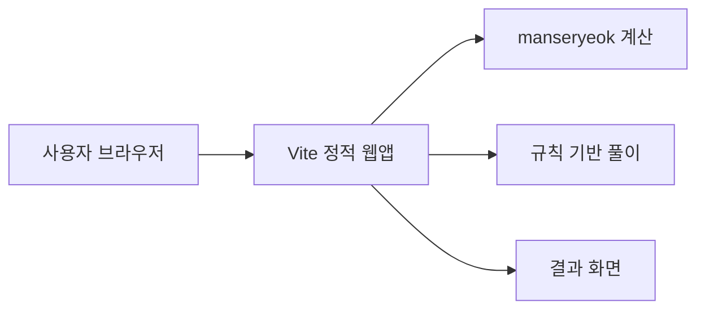
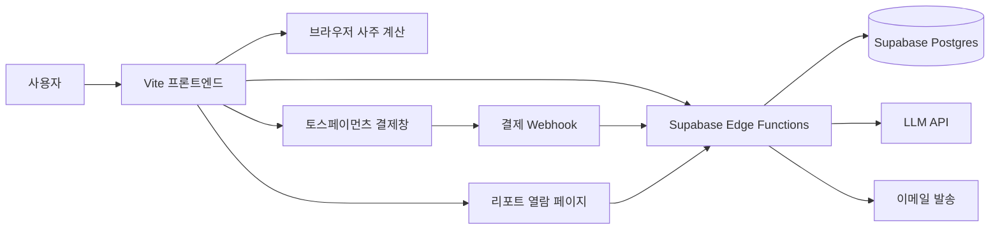
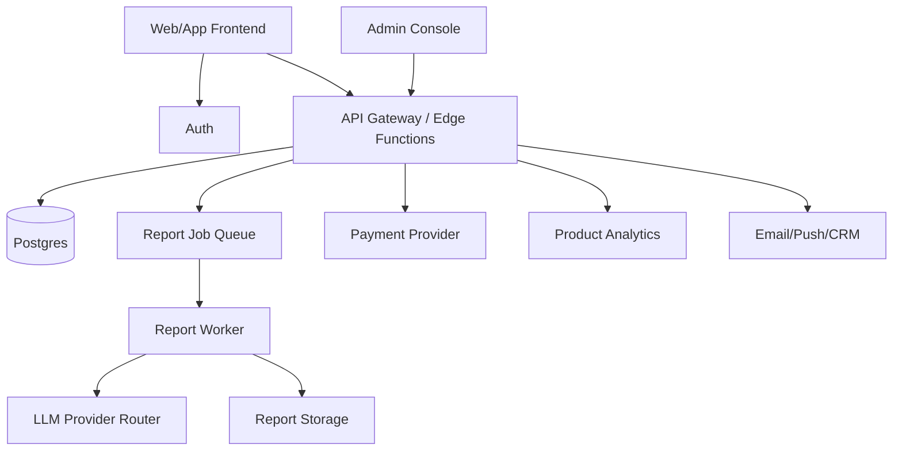

# Saajuu 수익화 마스터 플랜

작성일: 2026-07-07  
현재 상태: Vite 정적 웹앱(v0.2.0.0), 브라우저 내 `manseryeok` 기반 사주 계산 + 규칙 기반 상세 풀이, GitHub Pages 배포. 백엔드, 계정, 결제, AI 리포트는 아직 없음.

---

## 0. 최종 목표

Saajuu의 목표는 단순 사주 계산기가 아니라 **동양 명리 기반의 개인화 엔터테인먼트 리포트 플랫폼**이 되는 것이다. 초기에는 한국어 웹 기반 사주 리포트로 유료 결제를 검증하고, 이후 영어권 사용자에게는 "Korean astrology", "K-pop compatibility", "idol-inspired personality reading"처럼 K-culture 문맥을 붙인 가벼운 자기이해/팬덤형 콘텐츠로 확장한다.

핵심 수익 모델은 다음 순서로 확장한다.

1. **국내 단건 결제**: AI 심층 사주 리포트, 신년운세, 궁합 리포트.
2. **국내 반복 매출**: 월간 운세, 질문형 채팅, 시즌 패키지.
3. **미국 시장 테스트**: 영어 리포트, K-pop 팬덤형 궁합/성향 콘텐츠, SNS 공유형 카드.
4. **IP/제휴 기반 확장**: 실제 K-pop 연예인·그룹 IP는 반드시 라이선스나 공식 제휴 후 사용. 초기에는 무단 이름/초상/음성/AI 이미지 사용 없이 "K-pop archetype", "stage persona", "fandom compatibility"처럼 일반화된 카테고리로 검증한다.

북극성 지표는 **유료 리포트 구매 수와 재구매율**이다. 방문자 수는 중요하지만, 수익화 관점에서는 `방문자 -> 무료 풀이 완료 -> 프리미엄 클릭 -> 결제 완료 -> 리포트 만족/공유 -> 재방문` 퍼널을 계속 개선해야 한다.

---

## 1. 시장 배경과 전략적 판단

### 1.1 국내 시장

- 국내 점술 시장 규모는 약 1조 원대 이상으로 추정되며, 비대면·앱 기반 운세 소비가 빠르게 확산 중이다.
- 점신, 포스텔러 등 선도 서비스는 무료 운세로 유입을 만들고 상세 풀이, 궁합, 신년운세, 전화상담, 광고 등으로 수익화한다.
- 지배적 수익 모델은 **프리미엄(freemium)** 이다. 기본 운세는 무료로 제공하고, 개인화 깊이가 높은 해석은 유료화한다.
- 가격대는 990원 소액 단건부터 수만 원대 패키지까지 넓다. Saajuu의 초기 포지션은 부담 없는 단건 결제인 3,900~7,900원이 적합하다.

### 1.2 글로벌·미국 시장

- 글로벌 astrology app 시장은 여러 리서치 기관에서 연 20% 안팎의 고성장 카테고리로 보고 있다. 예: The Business Research Company는 astrology app 시장이 2025년 47.3억 달러에서 2026년 56.9억 달러로 성장한다고 제시했고, MarkNtel Advisors는 2024년 약 30억 달러에서 2030년 약 90억 달러 규모를 전망한다.
- 미국 시장은 서양 점성술, 타로, MBTI, 코칭, 웰니스 앱이 이미 익숙하다. 한국식 사주를 그대로 설명하기보다 **Korean birth chart**, **Four Pillars**, **K-culture personality reading**처럼 번역 가능한 제품 언어가 필요하다.
- K-pop 팬덤은 굿즈, 앨범, 콘서트, 멤버 성향 분석, 궁합 콘텐츠에 돈과 시간을 쓰는 성향이 강하다. Saajuu는 이 팬덤 소비를 직접 겨냥하되, 처음부터 실제 연예인 초상이나 이름을 상업적으로 활용하면 법무 리스크가 크므로 단계적으로 접근한다.

### 1.3 수익화의 핵심 가설

Saajuu가 결제받을 수 있는 이유는 "AI가 사주를 봐준다"가 아니라 다음 세 가지를 동시에 제공하기 때문이다.

1. **정확한 계산 근거**: 만세력 기반 사주팔자, 오행, 십신, 일간 등 계산 결과를 명확히 보여준다.
2. **개인화된 서사**: 성격, 관계, 커리어, 돈, 연애, 건강, 올해 흐름을 사용자의 입력값에 맞게 연결한다.
3. **공유 가능한 엔터테인먼트**: 결과 카드, 궁합 점수, 팬덤형 비교 콘텐츠를 통해 SNS 공유와 바이럴을 유도한다.

---

## 2. 제품 포지셔닝

### 2.1 한국어 제품명과 메시지

- 제품명: 사주 한 장 / Saajuu
- 한 줄 설명: "생년월일시로 보는 나의 사주, 오행, 성향 리포트"
- 유료 전환 문구: "기본 풀이로는 보이지 않는 커리어, 연애, 재물 흐름까지 AI 심층 리포트로 확인"

### 2.2 영어권 제품 메시지

- 제품명 후보: Saajuu, Korean Birth Chart, K-Fortune
- 한 줄 설명: "A Korean Four Pillars reading for personality, timing, love, and career."
- 팬덤형 메시지: "Discover your K-pop stage persona, relationship style, and compatibility archetype."

영어권에서는 "fortune telling"보다 "personality insight", "self-discovery", "compatibility", "timing"이 결제 저항이 낮다. 단, 의학·투자·법률·채용 등 중요한 결정을 대신해주는 표현은 피하고, 오락 및 자기성찰용 서비스임을 명확히 표시한다.

### 2.3 사용하지 말아야 할 포지션

- "연예인 누구와 실제 궁합이 맞는다"를 무단으로 상업화.
- 실제 아이돌 사진, 목소리, 이름, 그룹명, 팬덤명, 가사, 상표를 허가 없이 사용.
- "AI가 특정 연예인처럼 말해준다" 또는 "특정 연예인의 운세를 몰래 분석한다" 식의 제품.
- 건강, 합격, 투자, 결혼을 단정적으로 보장하는 문구.

---

## 3. 수익 모델 포트폴리오

| 모델 | 출시 단계 | 가격 | 필요 인프라 | 판단 |
|------|----------|------|------------|------|
| 디스플레이 광고 | Phase 0 | 무료 | 정적 웹 + 도메인 + 콘텐츠 | 보조 수익. 심사 준비용 콘텐츠 필요 |
| 제휴 링크 | Phase 0 | 무료 | 정적 웹 | 책, 다이어리, 굿즈 추천 등 자연스럽게 배치 가능 |
| AI 심층 사주 리포트 | Phase 1 | 3,900~5,900원 | 결제 + 백엔드 + LLM | 첫 핵심 수익원 |
| 신년운세/월간운세 | Phase 1.5 | 4,900~7,900원 | 리포트 템플릿 + 시즌 랜딩 | 성수기 매출용 |
| 궁합 리포트 | Phase 2 | 4,900~9,900원 | 2인 입력 + 비교 알고리즘 | 공유성과 결제 전환이 좋음 |
| 월 구독 | Phase 2 | 6,900~12,900원/월 | 계정 + 결제 갱신 + 히스토리 | 반복 매출. 단건 검증 후 |
| 질문형 AI 채팅 | Phase 2 | 구독 또는 크레딧 | 세션 저장 + 안전 가드레일 | 리텐션 강화 |
| 영어 리포트 | Phase 3 | $4.99~$9.99 | i18n + Stripe + 영어 프롬프트 | 미국 시장 테스트 |
| K-pop 팬덤형 리포트 | Phase 3 | $2.99~$7.99 | 영어 UX + 공유 카드 | 바이럴 실험용 |
| 공식 IP/연예인 제휴 | Phase 4 | 캠페인별 | 계약 + 권리 관리 + 정산 | 성공 시 큰 성장 가능. 초기에는 금지 |

---

## 4. 마스터 플랜

### 4.1 1차 목표: 결제 가능한 국내 MVP

무료 결과 화면에서 사용자가 충분히 신뢰를 느낀 뒤, "더 자세한 해석"에 결제하도록 만든다. 초기에는 계정 없이 이메일 또는 결과 링크로 리포트를 전달해 개발 복잡도를 낮춘다.

필수 기능:

- 기본 사주 계산과 오행/십신 근거 표시.
- 프리미엄 리포트 샘플 미리보기.
- 단건 결제.
- 결제 완료 후 AI 리포트 생성.
- 리포트 열람 링크와 이메일 발송.
- 환불/문의/개인정보/면책 문구.

### 4.2 2차 목표: 시즌형 매출 엔진

사주 서비스는 12월~2월 신년운세 성수기 효과가 크다. 따라서 일반 리포트보다 먼저 시즌 랜딩과 신년운세 상품을 준비해야 한다.

시즌 상품:

- 2027 신년운세 리포트.
- 2027 커리어/돈 흐름 리포트.
- 2027 연애운/관계운 리포트.
- 커플 궁합 + 내년 관계 흐름 리포트.

운영 원칙:

- 11월 전까지 결제와 리포트 생성 안정화.
- 12월부터 SEO 콘텐츠와 SNS 공유 카드 집중 배포.
- 성수기에는 장애 대응을 위해 LLM 호출 큐와 재시도 구조 준비.

### 4.3 3차 목표: 영어권 K-culture 확장

미국 시장은 한국식 명리 자체보다 "새로운 K-culture 기반 자기이해 콘텐츠"로 진입하는 편이 자연스럽다.

초기 영어 상품:

- Korean Four Pillars Personality Report.
- K-pop Stage Persona Reading.
- Bias Compatibility Archetype.
- Friendship/Couple Chemistry Report.
- 2027 K-Fortune Year Ahead.

중요한 원칙:

- 실제 K-pop 연예인의 이름, 사진, 목소리, 영상, 그룹명, 로고, 팬덤명은 허가 없이 결제 상품에 쓰지 않는다.
- "idol-inspired archetype"처럼 일반화된 성향 카테고리를 사용한다.
- 특정 연예인과의 직접 궁합이 아니라 "your performance energy", "relationship rhythm", "fandom personality" 같은 자기 분석으로 설계한다.
- 미국 결제는 Stripe, 세금/환불/개인정보는 별도 정책으로 분리한다.

### 4.4 4차 목표: 공식 IP·크리에이터 제휴

초기 지표가 검증되면 K-pop 연예인 또는 팬덤 IP를 직접 쓰는 대신, 다음 순서로 접근한다.

1. K-pop 커버댄스팀, 팬 크리에이터, 인플루언서와 저위험 제휴.
2. 소형 기획사 또는 신인 그룹의 팬 참여 캠페인.
3. 공식 굿즈/팬 이벤트와 연결된 운세 카드.
4. 대형 IP와 라이선스 계약.

제휴 상품 예시:

- "신인 그룹 멤버별 에너지 타입 카드" 캠페인.
- "팬 성향 테스트 + 멤버 메시지 카드" 이벤트.
- "컴백 시즌 운세 카드" 굿즈 번들.
- 콘서트 전후 팬 참여형 궁합/성향 페이지.

---

## 5. 목표 아키텍처

### 5.1 현재 구조

현재 구조는 개인정보를 외부로 보내지 않는 장점이 있지만, API 키 보호, 결제 검증, 리포트 저장, 이메일 발송, LLM 호출을 처리할 수 없다. 수익화 단계에서는 백엔드가 필수다.

### 5.2 Phase 1 목표 구조

핵심 설계:

- 사주 계산은 당분간 프론트에서 유지하되, 유료 리포트 생성 시 서버에서도 입력값과 계산 결과를 검증한다.
- 결제 완료는 프론트 결과만 믿지 않고 PG Webhook으로 확정한다.
- LLM API 키는 서버에만 둔다.
- 리포트는 `report_id`와 만료 가능한 `access_token`으로 열람한다.
- 계정 없이 시작하되, 이메일 기반 재열람 링크를 제공한다.

### 5.3 Phase 2 이후 구조

고도화 포인트:

- 결제, 리포트 생성, 이메일 발송을 비동기 작업으로 분리.
- LLM 공급자 라우터를 두어 Claude, OpenAI, Gemini 등 모델을 비용/품질 기준으로 교체 가능하게 설계.
- 한국 결제는 토스페이먼츠, 미국 결제는 Stripe로 분리.
- 상품 카탈로그, 가격, 쿠폰, 환불 상태를 DB에서 관리.
- 관리자 화면에서 주문, 리포트 생성 실패, 환불 요청, 사용자 문의를 확인.

---

## 6. 데이터 모델 초안

초기에는 최소 테이블만 둔다.

### 6.1 `orders`

| 필드 | 설명 |
|------|------|
| `id` | 내부 주문 ID |
| `provider` | `toss`, `stripe` |
| `provider_payment_key` | PG 결제 키 |
| `product_code` | `deep_report`, `yearly_2027`, `compatibility` |
| `amount` | 결제 금액 |
| `currency` | `KRW`, `USD` |
| `status` | `pending`, `paid`, `failed`, `refunded` |
| `email` | 리포트 전달용 이메일. 선택 입력으로 시작 가능 |
| `created_at` | 생성 시각 |

### 6.2 `birth_inputs`

| 필드 | 설명 |
|------|------|
| `id` | 입력 ID |
| `order_id` | 주문 연결 |
| `calendar_type` | 양력/음력 |
| `birth_date` | 생년월일 |
| `birth_hour` | 출생 시 |
| `birth_minute` | 출생 분 |
| `is_leap_month` | 윤달 여부 |
| `locale` | `ko-KR`, `en-US` |
| `retention_policy` | 즉시삭제, 리포트 만료일까지 보관 등 |

### 6.3 `reports`

| 필드 | 설명 |
|------|------|
| `id` | 리포트 ID |
| `order_id` | 주문 연결 |
| `status` | `queued`, `generating`, `ready`, `failed` |
| `chart_json` | 계산 근거 |
| `prompt_version` | 프롬프트 버전 |
| `model` | 사용 모델 |
| `content_md` | 리포트 본문 |
| `access_token_hash` | 열람 토큰 해시 |
| `expires_at` | 열람 만료 시각 |

### 6.4 `events`

| 필드 | 설명 |
|------|------|
| `id` | 이벤트 ID |
| `session_id` | 익명 세션 |
| `event_name` | `view_result`, `premium_click`, `checkout_start`, `purchase_complete`, `share_click` |
| `properties` | 상품, 가격, 화면 위치 등 |
| `created_at` | 발생 시각 |

---

## 7. AI 리포트 설계

### 7.1 리포트 구성

유료 리포트는 "길기만 한 텍스트"가 아니라 사용자가 돈을 냈다고 느낄 만큼 구조화되어야 한다.

권장 목차:

1. 핵심 요약: 5줄 요약, 강점, 주의점, 이번 달 질문.
2. 사주 원국 해석: 연주·월주·일주·시주의 의미.
3. 오행 균형: 강한 기운, 부족한 기운, 생활 보완법.
4. 십신 흐름: 관계, 표현, 돈, 책임, 배움의 패턴.
5. 커리어와 돈: 잘 맞는 일 방식, 피해야 할 환경, 수익화 힌트.
6. 연애와 관계: 끌리는 관계, 반복 패턴, 건강한 소통법.
7. 건강·루틴: 단정이 아닌 생활 리듬 제안.
8. 대운/세운 흐름: 큰 흐름과 올해의 주제.
9. 실행 가이드: 7일, 30일, 90일 액션.
10. 면책 문구: 오락/자기성찰용이며 중요한 결정의 단독 근거가 아님.

### 7.2 프롬프트 원칙

- 계산 결과를 먼저 구조화 JSON으로 주입한다.
- 모델이 임의로 생년월일을 재계산하지 않게 한다.
- "근거"와 "해석"을 분리한다.
- 사용자의 불안감을 과도하게 자극하지 않는다.
- 건강, 법률, 투자, 임신, 사망, 사고 등을 단정하지 않는다.
- 한국어와 영어 프롬프트를 별도로 운영한다.

### 7.3 품질 차별화

무료 AI 운세와 차별화하려면 아래 요소가 필요하다.

- 결과마다 다른 구조적 근거: 일간, 일지, 오행 수치, 십신 빈도, 계절 흐름.
- 과장 없는 문체: "반드시", "운명", "위험"보다 "경향", "살펴볼 수 있음", "도움이 됨".
- 구매자에게 남는 산출물: PDF 다운로드, 공유 카드, 30일 액션 플랜.
- 재구매 이유: 월간 흐름, 신년운세, 궁합, 특정 질문 리포트.

---

## 8. 고도화 단계별 플랜

### Phase 0: 수요 검증과 퍼널 구축 (1~2주)

목표: 사업자등록이나 백엔드 구축 전에 유료 수요와 유입 가능성을 확인한다.

작업:

- 커스텀 도메인 구입 및 GitHub Pages 연결.
- 결과 공유 이미지 카드 생성 기능.
- 카카오톡, X, Instagram Stories 공유 동선.
- "AI 심층 리포트 보기" 버튼 추가 후 클릭률 측정.
- SEO 콘텐츠 5개 작성: 오늘의 운세, 일주별 성격, 오행 설명, 십신 설명, 사주 보는 법.
- 애드센스/애드핏 심사용 기본 페이지: 소개, 문의, 개인정보처리방침, 이용약관.

성공 기준:

- 무료 풀이 완료자 중 프리미엄 클릭률 5% 이상.
- 공유 클릭률 3% 이상.
- 검색 유입 또는 직접 공유 유입이 발생.

### Phase 1: 국내 단건 결제 MVP (4~8주)

목표: 첫 유료 매출을 만든다.

작업:

- Supabase 프로젝트 생성.
- 토스페이먼츠 결제 연동.
- 결제 Webhook 검증.
- AI 리포트 생성 Edge Function 구현.
- 리포트 열람 페이지 구현.
- 이메일 발송 연동.
- 환불/문의 절차 문서화.
- 프롬프트 v1, 샘플 리포트 10개 생성 및 품질 검수.

상품:

- AI 심층 사주 리포트: 3,900원.
- 궁합 리포트 베타: 4,900원.
- 신년운세 예약 상품: 5,900원.

성공 기준:

- 월 유료 리포트 50건.
- 결제 완료 후 리포트 생성 성공률 98% 이상.
- 환불률 5% 이하.
- 구매자 만족 피드백 확보.

### Phase 1.5: 성수기 수익화 패키지 (2~4주)

목표: 신년운세 시즌 매출을 극대화한다.

작업:

- `2027 신년운세` 랜딩 페이지.
- SEO 콘텐츠 20개 이상 확장.
- 결과 카드 템플릿 5종.
- 할인 쿠폰과 번들 상품.
- 리포트 생성 큐와 실패 재시도.
- 관리자용 주문/실패 목록.

성공 기준:

- 시즌 랜딩 전환율 2% 이상.
- 월 매출 100만 원 이상.
- 재구매 상품 구매율 10% 이상.

### Phase 2: 계정, 구독, 리텐션 (8~12주)

목표: 일회성 운세에서 반복 사용 서비스로 전환한다.

작업:

- 이메일/소셜 로그인.
- 내 리포트 보관함.
- 월간 운세 구독.
- 질문형 AI 채팅.
- 웹 푸시 또는 이메일 리마인더.
- 사용자 선호 주제 저장: 커리어, 연애, 돈, 관계.
- 결제 갱신, 해지, 환불 플로우.

상품:

- 월간 운세 구독: 6,900~9,900원.
- 크레딧 10개: 9,900원.
- 연간 패키지: 49,000~79,000원.

성공 기준:

- 구독 전환율 1% 이상.
- 월 구독 해지율 8% 이하.
- 월 재방문율 25% 이상.

### Phase 3: 미국 시장 베타 (8~16주)

목표: 영어권에서 결제 가능한 포지션을 찾는다.

작업:

- 영어 UI와 영어 리포트 프롬프트.
- Stripe 결제 연동.
- USD 가격 실험: $4.99, $7.99, $9.99.
- TikTok/Instagram/Pinterest 공유 카드.
- K-pop archetype 테스트.
- 미국 개인정보/환불/광고 표시 문구 정비.
- `Korean Four Pillars` 교육형 콘텐츠 제작.

상품:

- Korean Four Pillars Report: $7.99.
- K-pop Stage Persona Reading: $4.99.
- Bias Compatibility Archetype: $3.99.
- Year Ahead K-Fortune: $9.99.

성공 기준:

- 영어 랜딩 무료 풀이 완료율 30% 이상.
- 유료 전환율 1% 이상.
- 공유율 5% 이상.
- CAC가 AOV보다 낮거나, 유기적 유입 성장 가능성이 확인됨.

### Phase 4: IP·크리에이터 제휴 (장기)

목표: 팬덤과 공식 IP를 결합한 고마진 캠페인 상품을 만든다.

작업:

- 제휴용 관리자 페이지와 캠페인 코드.
- 크리에이터별 랜딩 페이지.
- 수익 배분 정산 리포트.
- IP 사용 범위, 지역, 기간, 이미지 사용권 계약.
- FTC 광고/스폰서십 표시 체계.
- 미국 주별 퍼블리시티권 검토.

성공 기준:

- 제휴 캠페인 1건당 손익분기 달성.
- 캠페인 방문자 대비 구매율 2% 이상.
- 공식 IP 또는 크리에이터 채널에서 반복 캠페인 가능.

---

## 9. 미국·K-pop 확장 시 법무 리스크

K-pop 연예인 활용은 성장 기회이지만, 가장 큰 리스크이기도 하다. 특히 미국은 주별로 이름, 초상, 목소리, 이미지, 정체성의 상업적 이용을 보호하는 right of publicity가 강하게 적용될 수 있다.

반드시 피해야 할 것:

- 허가 없이 실제 연예인 이름을 결제 상품명에 사용.
- 허가 없이 사진, 영상, 음성, AI 생성 초상, 그룹 로고를 사용.
- "BTS 멤버와 궁합", "BLACKPINK 스타일 AI 리포트"처럼 상표·퍼블리시티권 침해 가능성이 있는 표현.
- 팬이 업로드한 이미지나 영상을 광고 소재로 재사용.
- 협찬, 제휴, 광고 관계를 숨기는 인플루언서 마케팅.

허용 가능성이 높은 초기 대안:

- "K-pop stage persona", "idol energy archetype", "fandom personality"처럼 일반 카테고리 사용.
- 실제 인물이 아닌 자체 캐릭터와 자체 세계관 사용.
- 공식 계약을 체결한 크리에이터·팀·기획사에 한해 이름/이미지 사용.
- 모든 광고성 콘텐츠에 명확한 유료 제휴 표시.

Phase 3 이전에는 반드시 미국 IP/광고 법무 검토를 받는 것이 좋다.

---

## 10. 비용·수익 추정

### 10.1 국내 초기 비용

| 항목 | 월 비용 추정 |
|------|-------------|
| 도메인 | 약 2,000원 환산 |
| GitHub Pages | 0원 |
| Supabase | 무료 ~ $25 |
| LLM API | 사용량 기반 |
| 이메일 발송 | 무료 티어 ~ 소액 |
| 결제 수수료 | 결제액의 약 3%대 |

초기 고정비는 낮다. 손익분기 자체는 어렵지 않지만, 트래픽과 전환율이 핵심이다.

### 10.2 단건 리포트 수익 예시

단가 3,900원, LLM 원가 300원, PG 수수료 3.3%로 단순 계산하면 건당 대략 3,400원 내외의 공헌이익이 남는다.

| 시나리오 | 일 방문자 | 무료 풀이 완료율 | 유료 전환율 | 월 매출 |
|---------|----------|----------------|------------|---------|
| 보수적 | 100명 | 40% | 1% | 약 5만 원 |
| 기본 | 500명 | 45% | 2% | 약 105만 원 |
| 성장 | 2,000명 | 50% | 2.5% | 약 585만 원 |
| 신년 성수기 | 5,000명 | 55% | 3% | 약 1,930만 원 |

### 10.3 미국 베타 수익 예시

단가 $7.99, 유료 전환율 1%, 월 방문자 30,000명이라면 월 매출은 약 $2,397 수준이다. 미국 시장은 광고 단가와 결제 단가가 높을 수 있지만, 콘텐츠 현지화, 법무, 고객지원, 마케팅 비용이 커진다. 따라서 Phase 3은 대규모 투자보다 **작은 영어 랜딩과 유료 광고 소액 테스트**로 시작해야 한다.

---

## 11. 운영 지표

필수로 봐야 할 지표:

- 랜딩 방문자 수.
- 생년월일 입력 시작률.
- 무료 풀이 완료율.
- 프리미엄 버튼 클릭률.
- 결제창 진입률.
- 결제 완료율.
- 리포트 생성 성공률.
- 리포트 열람률.
- 공유 클릭률.
- 환불률.
- 재구매율.
- 구독 전환율과 해지율.

초기 목표:

- 무료 풀이 완료율: 40% 이상.
- 프리미엄 클릭률: 5% 이상.
- 결제 완료율: 결제창 진입 대비 40% 이상.
- 유료 전환율: 전체 방문자 대비 1~2%.
- 환불률: 5% 이하.

---

## 12. 리스크와 대응

| 리스크 | 영향 | 대응 |
|--------|------|------|
| 트래픽 부족 | 매출 미발생 | SEO, 공유 카드, 시즌 랜딩, 커뮤니티 배포 |
| 결제 전환 부족 | 수익화 실패 | 샘플 리포트 공개, 가격 테스트, 상품명 개선 |
| LLM 품질 불만 | 환불 증가 | 프롬프트 버전 관리, 금지 표현, 샘플 검수 |
| 개인정보 부담 | 법적/신뢰 리스크 | 최소 수집, 보관 기간 명시, 즉시 삭제 옵션 |
| 겸업 규정 | 개인 리스크 | 회사 취업규칙 확인 후 사업자/명의 구조 결정 |
| PG/세금/통신판매 | 출시 지연 | Phase 0 중 행정 준비 병행 |
| 미국 IP 침해 | 법무 리스크 큼 | 실제 연예인·상표 무단 사용 금지, 제휴 후 사용 |
| FTC 광고 표시 위반 | 캠페인 중단/제재 | 협찬/제휴/광고 표시를 명확히 노출 |
| 대형 경쟁사 | 차별화 어려움 | 웹 기반, 근거 기반, K-culture 포지션으로 틈새 공략 |

---

## 13. 바로 다음 실행 계획

### 이번 주

- [ ] 회사 겸업 규정 확인.
- [ ] 도메인 후보 3개 선정 및 구매.
- [ ] 결과 공유 카드 기능 범위 정의.
- [ ] 프리미엄 클릭 측정 이벤트 추가.
- [ ] 개인정보처리방침, 이용약관, 면책 문구 초안 작성.

### 2주 내

- [ ] SEO 콘텐츠 5개 작성.
- [ ] 프리미엄 리포트 샘플 3개 작성.
- [ ] 가격 테스트 후보 확정: 3,900원, 4,900원, 5,900원.
- [ ] Supabase와 토스페이먼츠 기술 검토.
- [ ] 주문/리포트 DB 스키마 초안 확정.

### 1개월 내

- [ ] 토스페이먼츠 테스트 결제 연동.
- [ ] Supabase Edge Function으로 리포트 생성 PoC.
- [ ] 리포트 열람 페이지 구현.
- [ ] 이메일 발송 연동.
- [ ] 베타 사용자 10명에게 샘플 리포트 피드백 수집.

### 3개월 내

- [ ] 국내 단건 결제 정식 출시.
- [ ] 신년운세 상품 출시.
- [ ] 궁합 리포트 베타 출시.
- [ ] 관리자용 주문/실패/환불 확인 화면 구축.
- [ ] 영어 랜딩 카피와 K-pop archetype 상품 테스트 준비.

---

## 14. 참고 자료

- [The Business Research Company - Astrology App Global Market Report](https://www.thebusinessresearchcompany.com/report/astrology-app-global-market-report)
- [MarkNtel Advisors - Global Astrology App Market Research Report 2025-2030](https://www.marknteladvisors.com/research-library/astrology-app-market.html)
- [매거진한경 - 쑥쑥 크는 비대면 점술 시장](https://magazine.hankyung.com/business/article/202405226315b)
- [ZDNet - 포스텔러 인터뷰](https://zdnet.co.kr/view/?no=20250203104315)
- [운세 플랫폼 성장 분석 - innoforest](https://www.innoforest.co.kr/report/NS00000275)
- [토스페이먼츠](https://www.tosspayments.com/)
- [FTC - Endorsements, Influencers, and Reviews](https://www.ftc.gov/business-guidance/advertising-marketing/endorsements-influencers-reviews)
- [Blank Rome - Right of Publicity and AI](https://www.blankrome.com/news-and-events/breaking-down-intersection-right-publicity-law-ai/)
- [Debevoise - New York AI and Right of Publicity Law](https://www.debevoise.com/insights/publications/2025/12/new-york-enacts-landmark-ai-right-of-publicity-law)
