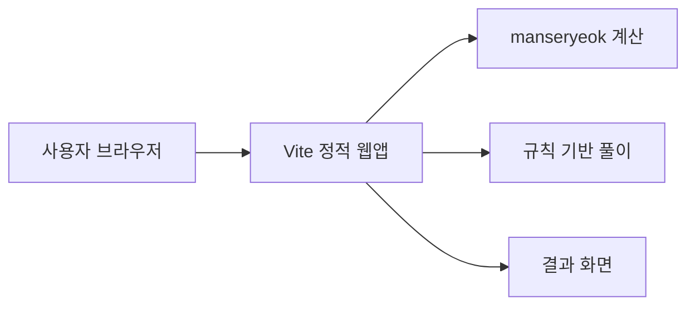
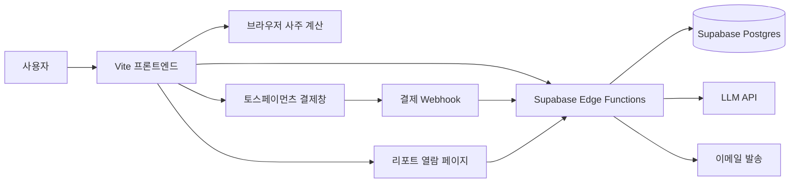
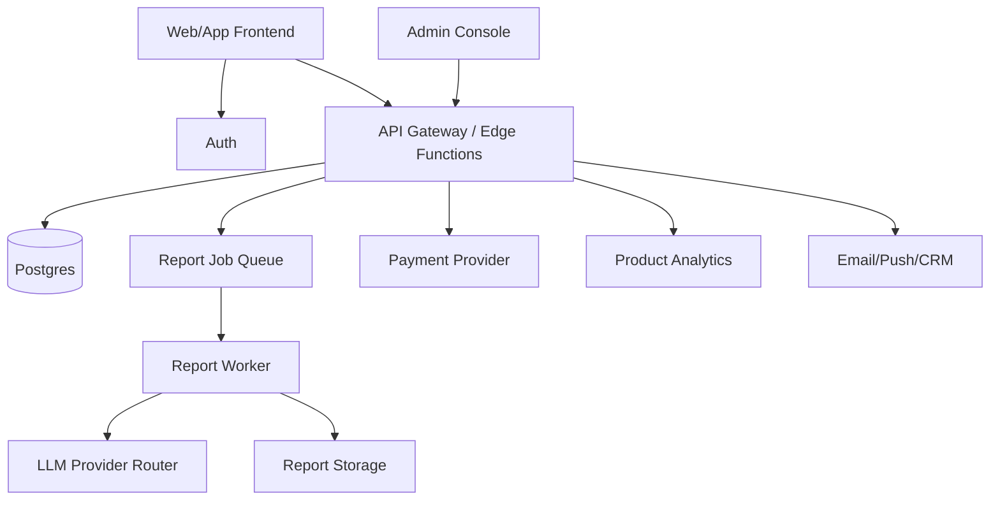
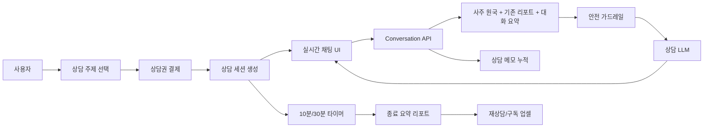

# Saajuu 수익화 마스터 플랜

작성일: 2026-07-07  
현재 상태: Vite 정적 웹앱(v0.2.0.0), 브라우저 내 `manseryeok` 기반 사주 계산 + 규칙 기반 상세 풀이, GitHub Pages 배포. 백엔드, 계정, 결제, AI 리포트는 아직 없음.

---

## 0. 최종 목표

Saajuu의 목표는 단순 사주 계산기가 아니라 **동양 명리 기반의 주제별 운세 리포트와 상담형 엔터테인먼트 플랫폼**이 되는 것이다. 초기에는 한국어 웹 기반 사주 리포트로 유료 결제를 검증하고, 이후 궁합, 결혼, 자녀운, 사업운처럼 실제 사용자가 반복적으로 묻는 질문을 상품화한다. 장기적으로는 영어권 사용자에게 "Korean astrology", "K-pop compatibility", "idol-inspired personality reading"처럼 K-culture 문맥을 붙인 가벼운 자기이해/팬덤형 콘텐츠로 확장한다.

핵심 수익 모델은 다음 순서로 확장한다.

1. **국내 단건 결제**: AI 심층 사주 리포트, 신년운세, 궁합 리포트.
2. **국내 주제별 상품**: 결혼운, 자녀운, 사업운, 직업운, 재물운 등 명쾌한 질문형 리포트.
3. **국내 상담형 매출**: 10분/30분 AI 점술가 상담, 월간 상담권, 시즌 패키지.
4. **미국 시장 테스트**: 영어 리포트, K-pop 팬덤형 궁합/성향 콘텐츠, SNS 공유형 카드.
5. **IP/제휴 기반 확장**: 실제 K-pop 연예인·그룹 IP는 반드시 라이선스나 공식 제휴 후 사용. 초기에는 무단 이름/초상/음성/AI 이미지 사용 없이 "K-pop archetype", "stage persona", "fandom compatibility"처럼 일반화된 카테고리로 검증한다.

북극성 지표는 **유료 리포트 구매 수와 재구매율**이다. 방문자 수는 중요하지만, 수익화 관점에서는 `방문자 -> 무료 풀이 완료 -> 프리미엄 클릭 -> 결제 완료 -> 리포트 만족/공유 -> 재방문` 퍼널을 계속 개선해야 한다.

---

## 1. 시장 배경과 전략적 판단

### 1.1 국내 시장

- 국내 점술 시장 규모는 약 1조 원대 이상으로 추정되며, 비대면·앱 기반 운세 소비가 빠르게 확산 중이다.
- 점신, 포스텔러 등 선도 서비스는 무료 운세로 유입을 만들고 상세 풀이, 궁합, 신년운세, 전화상담, 광고 등으로 수익화한다.
- 지배적 수익 모델은 **프리미엄(freemium)** 이다. 기본 운세는 무료로 제공하고, 개인화 깊이가 높은 해석은 유료화한다.
- 가격대는 990원 소액 단건부터 수만 원대 패키지까지 넓다. Saajuu의 초기 포지션은 부담 없는 단건 결제인 3,900~7,900원이 적합하다.

### 1.2 글로벌·미국 시장

- 글로벌 astrology app 시장은 여러 리서치 기관에서 연 20% 안팎의 고성장 카테고리로 보고 있다. 예: The Business Research Company는 astrology app 시장이 2025년 47.3억 달러에서 2026년 56.9억 달러로 성장한다고 제시했고, MarkNtel Advisors는 2024년 약 30억 달러에서 2030년 약 90억 달러 규모를 전망한다.
- 미국 시장은 서양 점성술, 타로, MBTI, 코칭, 웰니스 앱이 이미 익숙하다. 한국식 사주를 그대로 설명하기보다 **Korean birth chart**, **Four Pillars**, **K-culture personality reading**처럼 번역 가능한 제품 언어가 필요하다.
- K-pop 팬덤은 굿즈, 앨범, 콘서트, 멤버 성향 분석, 궁합 콘텐츠에 돈과 시간을 쓰는 성향이 강하다. Saajuu는 이 팬덤 소비를 직접 겨냥하되, 처음부터 실제 연예인 초상이나 이름을 상업적으로 활용하면 법무 리스크가 크므로 단계적으로 접근한다.

### 1.3 수익화의 핵심 가설

Saajuu가 결제받을 수 있는 이유는 "AI가 사주를 봐준다"가 아니라 다음 세 가지를 동시에 제공하기 때문이다.

1. **정확한 계산 근거**: 만세력 기반 사주팔자, 오행, 십신, 일간 등 계산 결과를 명확히 보여준다.
2. **개인화된 서사**: 성격, 관계, 커리어, 돈, 연애, 건강, 올해 흐름을 사용자의 입력값에 맞게 연결한다.
3. **공유 가능한 엔터테인먼트**: 결과 카드, 궁합 점수, 팬덤형 비교 콘텐츠를 통해 SNS 공유와 바이럴을 유도한다.

---

## 2. 제품 포지셔닝

### 2.1 한국어 제품명과 메시지

- 제품명: 사주 한 장 / Saajuu
- 한 줄 설명: "생년월일시로 보는 나의 사주, 오행, 성향 리포트"
- 유료 전환 문구: "기본 풀이로는 보이지 않는 커리어, 연애, 재물 흐름까지 AI 심층 리포트로 확인"

### 2.2 영어권 제품 메시지

- 제품명 후보: Saajuu, Korean Birth Chart, K-Fortune
- 한 줄 설명: "A Korean Four Pillars reading for personality, timing, love, and career."
- 팬덤형 메시지: "Discover your K-pop stage persona, relationship style, and compatibility archetype."

영어권에서는 "fortune telling"보다 "personality insight", "self-discovery", "compatibility", "timing"이 결제 저항이 낮다. 단, 의학·투자·법률·채용 등 중요한 결정을 대신해주는 표현은 피하고, 오락 및 자기성찰용 서비스임을 명확히 표시한다.

### 2.3 사용하지 말아야 할 포지션

- "연예인 누구와 실제 궁합이 맞는다"를 무단으로 상업화.
- 실제 아이돌 사진, 목소리, 이름, 그룹명, 팬덤명, 가사, 상표를 허가 없이 사용.
- "AI가 특정 연예인처럼 말해준다" 또는 "특정 연예인의 운세를 몰래 분석한다" 식의 제품.
- 건강, 합격, 투자, 결혼을 단정적으로 보장하는 문구.

---

## 3. 수익 모델 포트폴리오

| 모델 | 출시 단계 | 가격 | 필요 인프라 | 판단 |
|------|----------|------|------------|------|
| 디스플레이 광고 | Phase 0 | 무료 | 정적 웹 + 도메인 + 콘텐츠 | 보조 수익. 심사 준비용 콘텐츠 필요 |
| 제휴 링크 | Phase 0 | 무료 | 정적 웹 | 책, 다이어리, 굿즈 추천 등 자연스럽게 배치 가능 |
| AI 심층 사주 리포트 | Phase 1 | 3,900~5,900원 | 결제 + 백엔드 + LLM | 첫 핵심 수익원 |
| 신년운세/월간운세 | Phase 1.5 | 4,900~7,900원 | 리포트 템플릿 + 시즌 랜딩 | 성수기 매출용 |
| 주제별 명쾌 풀이 | Phase 1.5 | 2,900~6,900원 | 질문 카테고리 + 리포트 템플릿 | 궁합, 결혼, 자녀운, 사업운 등 검색 수요 대응 |
| 궁합 리포트 | Phase 2 | 4,900~9,900원 | 2인 입력 + 비교 알고리즘 | 공유성과 결제 전환이 좋음 |
| 월 구독 | Phase 2 | 6,900~12,900원/월 | 계정 + 결제 갱신 + 히스토리 | 반복 매출. 단건 검증 후 |
| 질문형 AI 채팅 | Phase 2 | 구독 또는 크레딧 | 세션 저장 + 안전 가드레일 | 리텐션 강화 |
| 30분 AI 점술가 상담 | Phase 2.5 | 19,900~39,000원 | 실시간 대화 + 세션 타이머 + 요약 리포트 | 실제 상담에 가까운 고가 상품 |
| 영어 리포트 | Phase 3 | $4.99~$9.99 | i18n + Stripe + 영어 프롬프트 | 미국 시장 테스트 |
| K-pop 팬덤형 리포트 | Phase 3 | $2.99~$7.99 | 영어 UX + 공유 카드 | 바이럴 실험용 |
| 공식 IP/연예인 제휴 | Phase 4 | 캠페인별 | 계약 + 권리 관리 + 정산 | 성공 시 큰 성장 가능. 초기에는 금지 |

### 3.1 실제 결제되는 콘텐츠 카테고리

사람들이 운세 서비스에 돈을 내는 이유는 추상적인 "내 사주가 궁금하다"보다 **지금 답이 필요한 질문**이 있기 때문이다. 따라서 상품은 사주 이론 중심이 아니라 사용자의 질문 키워드 중심으로 설계한다.

| 카테고리 | 사용자의 실제 질문 | 초기 상품 | 가격대 | 핵심 출력 |
|----------|------------------|----------|--------|----------|
| 신년·월간 운세 | "올해 뭐가 좋아지고 조심할 건 뭐지?" | 2027 신년운세, 이번 달 운세 | 4,900~7,900원 | 올해 키워드, 좋은 달/주의 달, 90일 액션 |
| 궁합 | "이 사람과 잘 맞나?", "왜 자꾸 부딪히지?" | 연인/썸/부부/친구 궁합 | 4,900~9,900원 | 관계 점수, 끌림 포인트, 갈등 패턴, 대화법 |
| 결혼운 | "결혼 시기와 배우자운이 궁금하다" | 결혼운 리포트 | 5,900~9,900원 | 결혼관, 맞는 배우자상, 관계 안정 시기, 주의 패턴 |
| 자녀운 | "자녀 인연이나 양육 방향이 궁금하다" | 자녀운·가족운 리포트 | 5,900~9,900원 | 가족관, 돌봄 방식, 부모 역할, 주의할 소통 방식 |
| 사업운 | "창업해도 될까?", "동업이 맞나?" | 사업운·창업운 리포트 | 7,900~19,900원 | 사업 성향, 돈 버는 방식, 파트너십, 리스크 관리 |
| 직업·이직운 | "내가 어떤 일을 해야 하지?", "이직 타이밍은?" | 커리어 리포트 | 5,900~12,900원 | 맞는 업무환경, 강점, 피해야 할 조직, 전환 타이밍 |
| 재물운 | "돈이 모이는 스타일인가?", "어떻게 관리해야 하지?" | 재물운 리포트 | 4,900~9,900원 | 수입 방식, 소비 패턴, 돈 관리 습관. 투자 조언은 금지 |
| 택일·시기 | "계약, 이사, 오픈 날짜가 괜찮을까?" | 날짜 후보 비교 리포트 | 3,900~9,900원 | 후보 날짜 비교, 심리적 의사결정 보조. 보장 표현 금지 |
| K-pop 팬덤형 | "내 무대 성향은?", "최애와 같은 에너지 타입은?" | Stage Persona, Bias Archetype | $2.99~$7.99 | 성향 타입, 무대 에너지, 팬덤 공유 카드 |

초기에는 모든 카테고리를 한 번에 구현하지 않는다. **신년운세, 궁합, 결혼운, 사업운** 네 가지가 결제 전환과 검색 수요 측면에서 가장 우선순위가 높다. 자녀운은 민감한 주제이므로 단정적인 표현을 피하고 "가족관, 돌봄 성향, 양육 커뮤니케이션" 중심으로 표현한다.

### 3.2 주제별 풀이의 표준 포맷

유료 콘텐츠는 사용자가 결론을 빨리 이해할 수 있어야 한다. 모든 주제별 리포트는 다음 포맷을 공유한다.

1. **한 줄 결론**: "이 관계는 끌림은 강하지만 속도 조절이 중요합니다."
2. **핵심 점수 또는 신호등**: 좋음/보통/주의, 또는 5개 항목 레이더.
3. **사주 근거**: 일간, 오행 균형, 십신, 지지 관계 등 3~5개 근거.
4. **명쾌한 해석**: 성격, 관계, 돈, 일, 시기 중 해당 질문에 직접 답한다.
5. **주의할 패턴**: 사용자가 실제로 조심할 행동을 구체화한다.
6. **실행 가이드**: 7일, 30일, 90일 단위 행동 제안.
7. **재질문 유도**: "상담으로 더 물어볼 질문" 3개를 제안해 LLM 상담으로 연결한다.

이 포맷을 유지하면 카테고리가 늘어도 품질과 개발 구조가 흔들리지 않는다.

### 3.3 30분 AI 점술가 상담 상품

가장 완성도 높은 수익화 구조는 단건 리포트 이후 **실제 점술가와 대화하는 듯한 예약형 AI 상담**이다. 사용자는 리포트를 읽다가 더 구체적인 질문이 생기고, 이때 30분 상담권을 구매하도록 설계한다.

상품 구조:

| 상품 | 가격 | 제공 내용 | 목적 |
|------|------|----------|------|
| 10분 빠른 상담 | 6,900~9,900원 | 질문 3~5개, 세션 요약 | 첫 상담 진입 장벽 낮추기 |
| 30분 심층 상담 | 19,900~39,000원 | 실시간 대화, 상담 메모, 마무리 리포트 | 핵심 고가 상품 |
| 월간 상담권 | 29,900~59,000원/월 | 월 2~4회 상담 + 월간 리포트 | 반복 매출 |
| 프리미엄 패키지 | 79,000원+ | 신년운세 + 궁합 + 30분 상담 | 성수기 객단가 상승 |

상담 UX:

- 사용자는 상담 주제를 먼저 고른다: 궁합, 결혼, 자녀, 사업, 이직, 재물, 신년운세.
- 결제 후 30분 타이머가 시작되고 채팅방에 입장한다.
- AI는 사용자의 사주 원국, 기존 리포트, 선택 주제, 대화 기록을 바탕으로 답한다.
- 답변은 "점술가처럼 따뜻하지만 단정하지 않는" 문체를 사용한다.
- 상담 중간에 핵심 내용을 메모 형태로 축적한다.
- 종료 후 "상담 요약 + 다음 행동 + 다시 물어볼 질문" 리포트를 자동 생성한다.

상담 품질 원칙:

- 첫 응답은 바로 풀이하지 않고 질문을 좁힌다. 예: "궁합 중에서도 결혼 가능성, 갈등 원인, 연락 문제 중 어디가 가장 궁금하세요?"
- 한 번에 긴 일반론을 말하지 않고, 실제 상담처럼 짧게 묻고 답한다.
- "무조건 결혼한다", "사업하면 성공한다", "자녀가 생긴다" 같은 보장형 표현은 금지한다.
- 돈, 건강, 임신, 법률, 투자, 이혼 등 고위험 주제는 의사결정 보조와 자기성찰로 한정한다.
- 상담 종료 시 사용자가 가져갈 결론을 3개 이하로 정리한다.

이 상담 상품은 단순 챗봇이 아니라 **시간 제한, 상담 주제, 사주 근거, 세션 요약, 재상담 동선**이 결합된 유료 경험이어야 한다. 그래야 "무료 AI에게 물어보면 되지 않나?"라는 반론을 넘을 수 있다.

---

## 4. 마스터 플랜

### 4.1 1차 목표: 결제 가능한 국내 MVP

무료 결과 화면에서 사용자가 충분히 신뢰를 느낀 뒤, "더 자세한 해석"에 결제하도록 만든다. 초기에는 계정 없이 이메일 또는 결과 링크로 리포트를 전달해 개발 복잡도를 낮춘다.

필수 기능:

- 기본 사주 계산과 오행/십신 근거 표시.
- 프리미엄 리포트 샘플 미리보기.
- 단건 결제.
- 결제 완료 후 AI 리포트 생성.
- 리포트 열람 링크와 이메일 발송.
- 환불/문의/개인정보/면책 문구.

### 4.2 2차 목표: 시즌형 매출 엔진

사주 서비스는 12월~2월 신년운세 성수기 효과가 크다. 따라서 일반 리포트보다 먼저 시즌 랜딩과 신년운세 상품을 준비해야 한다.

시즌 상품:

- 2027 신년운세 리포트.
- 2027 커리어/돈 흐름 리포트.
- 2027 연애운/관계운 리포트.
- 커플 궁합 + 내년 관계 흐름 리포트.

운영 원칙:

- 11월 전까지 결제와 리포트 생성 안정화.
- 12월부터 SEO 콘텐츠와 SNS 공유 카드 집중 배포.
- 성수기에는 장애 대응을 위해 LLM 호출 큐와 재시도 구조 준비.

### 4.3 3차 목표: 주제별 콘텐츠 상품 엔진

신년운세만으로는 계절성이 강하다. 연중 매출을 만들려면 사람들이 반복적으로 검색하고 결제하는 키워드를 상품화해야 한다. 핵심은 "사주 전체 풀이"가 아니라 **궁금한 질문 하나에 명쾌하게 답하는 소형 상품**을 여러 개 만드는 것이다.

우선순위:

1. **궁합**: 연인, 썸, 부부, 친구, 동업자까지 확장 가능. 공유성과 재구매 가능성이 높다.
2. **결혼운**: 결혼 시기, 배우자상, 관계 안정성, 혼인 생활 패턴. 고관여 주제라 객단가를 높일 수 있다.
3. **사업운**: 창업, 동업, 돈 버는 방식, 리더십, 리스크. 커리어보다 더 높은 가격을 받을 수 있다.
4. **자녀운·가족운**: 민감하지만 수요가 꾸준하다. 단정 대신 가족관과 양육 커뮤니케이션으로 설계한다.
5. **월간/시기운**: 반복 방문과 구독으로 연결된다.

제품 운영 방식:

- 각 카테고리는 독립 랜딩 페이지를 가진다.
- 무료 결과 화면에서 사용자의 사주 특성에 맞는 주제 상품을 추천한다.
- 예: 재성/관성/식상 흐름에 따라 "사업운 리포트", "결혼운 리포트", "커리어 리포트"를 다르게 노출.
- 각 리포트 끝에는 "이 주제로 30분 상담하기" CTA를 둔다.
- 검색 유입용 콘텐츠와 유료 리포트 목차를 연결한다. 예: "결혼운 보는 법" SEO 글 하단에 결혼운 리포트 결제.

콘텐츠 생산 순서:

1. 무료 설명 글: 검색 유입용.
2. 샘플 리포트: 결제 전 미리보기.
3. 유료 리포트 템플릿: LLM이 채우는 구조.
4. 상담 프롬프트: 리포트 이후 대화용.
5. 공유 카드: 결과 일부를 바이럴용으로 변환.

### 4.4 4차 목표: 상담형 수익화 엔진

리포트는 첫 결제를 만들고, 상담은 객단가와 재구매를 만든다. 사용자는 "내가 이 사람과 결혼해도 될까?", "동업자가 맞을까?", "지금 사업을 시작해도 될까?"처럼 맥락이 긴 질문을 갖고 있다. 이 질문은 정적 리포트보다 대화형 상담에서 더 높은 가치를 느낀다.

상담형 엔진의 목표:

- 30분 세션을 구매하는 명확한 상품 경험.
- 실제 점술가처럼 질문을 좁히고, 사용자의 맥락을 반영하는 대화.
- 상담 종료 후 요약 리포트를 제공해 돈을 낸 흔적을 남김.
- 다음 상담 또는 월 구독으로 이어지는 반복 구조.

상담 전환 흐름:

1. 무료 풀이 완료.
2. 사용자가 궁합/결혼/사업 등 주제별 리포트 구매.
3. 리포트 마지막에 "이 사안은 대화로 풀어보는 것이 좋습니다" CTA 노출.
4. 10분 빠른 상담 또는 30분 심층 상담 결제.
5. 상담 종료 후 요약 리포트와 다음 질문 추천.
6. 월간 상담권 또는 시즌 패키지로 업셀.

### 4.5 5차 목표: 영어권 K-culture 확장

미국 시장은 한국식 명리 자체보다 "새로운 K-culture 기반 자기이해 콘텐츠"로 진입하는 편이 자연스럽다.

초기 영어 상품:

- Korean Four Pillars Personality Report.
- K-pop Stage Persona Reading.
- Bias Compatibility Archetype.
- Friendship/Couple Chemistry Report.
- 2027 K-Fortune Year Ahead.

중요한 원칙:

- 실제 K-pop 연예인의 이름, 사진, 목소리, 영상, 그룹명, 로고, 팬덤명은 허가 없이 결제 상품에 쓰지 않는다.
- "idol-inspired archetype"처럼 일반화된 성향 카테고리를 사용한다.
- 특정 연예인과의 직접 궁합이 아니라 "your performance energy", "relationship rhythm", "fandom personality" 같은 자기 분석으로 설계한다.
- 미국 결제는 Stripe, 세금/환불/개인정보는 별도 정책으로 분리한다.

### 4.6 6차 목표: 공식 IP·크리에이터 제휴

초기 지표가 검증되면 K-pop 연예인 또는 팬덤 IP를 직접 쓰는 대신, 다음 순서로 접근한다.

1. K-pop 커버댄스팀, 팬 크리에이터, 인플루언서와 저위험 제휴.
2. 소형 기획사 또는 신인 그룹의 팬 참여 캠페인.
3. 공식 굿즈/팬 이벤트와 연결된 운세 카드.
4. 대형 IP와 라이선스 계약.

제휴 상품 예시:

- "신인 그룹 멤버별 에너지 타입 카드" 캠페인.
- "팬 성향 테스트 + 멤버 메시지 카드" 이벤트.
- "컴백 시즌 운세 카드" 굿즈 번들.
- 콘서트 전후 팬 참여형 궁합/성향 페이지.

---

## 5. 목표 아키텍처

### 5.1 현재 구조

현재 구조는 개인정보를 외부로 보내지 않는 장점이 있지만, API 키 보호, 결제 검증, 리포트 저장, 이메일 발송, LLM 호출을 처리할 수 없다. 수익화 단계에서는 백엔드가 필수다.

### 5.2 Phase 1 목표 구조

핵심 설계:

- 사주 계산은 당분간 프론트에서 유지하되, 유료 리포트 생성 시 서버에서도 입력값과 계산 결과를 검증한다.
- 결제 완료는 프론트 결과만 믿지 않고 PG Webhook으로 확정한다.
- LLM API 키는 서버에만 둔다.
- 리포트는 `report_id`와 만료 가능한 `access_token`으로 열람한다.
- 계정 없이 시작하되, 이메일 기반 재열람 링크를 제공한다.

### 5.3 Phase 2 이후 구조

고도화 포인트:

- 결제, 리포트 생성, 이메일 발송을 비동기 작업으로 분리.
- LLM 공급자 라우터를 두어 Claude, OpenAI, Gemini 등 모델을 비용/품질 기준으로 교체 가능하게 설계.
- 한국 결제는 토스페이먼츠, 미국 결제는 Stripe로 분리.
- 상품 카탈로그, 가격, 쿠폰, 환불 상태를 DB에서 관리.
- 관리자 화면에서 주문, 리포트 생성 실패, 환불 요청, 사용자 문의를 확인.

### 5.4 30분 상담형 LLM 구조

상담형 상품은 일반 채팅과 다르게 돈을 낸 세션 경험이 명확해야 한다. 핵심은 결제된 시간, 상담 주제, 사주 근거, 대화 맥락, 종료 요약을 하나의 흐름으로 묶는 것이다.

필수 컴포넌트:

- **상담 세션 상태**: `paid`, `waiting`, `active`, `ended`, `expired`.
- **시간 제한**: 결제한 시간만큼 대화 가능. 종료 5분 전 알림.
- **주제 스코프**: 궁합, 결혼, 사업 등 선택 주제에서 벗어나면 부드럽게 다시 좁힘.
- **메모리 압축**: 전체 대화를 매번 LLM에 넣지 않고 핵심 메모를 누적 요약.
- **상담 종료 리포트**: 사용자가 돈을 냈다고 느낄 수 있는 결과물.
- **금지 응답 필터**: 건강, 임신, 투자, 법률, 사고, 죽음, 보장 표현 제한.
- **운영자 리뷰 큐**: 품질 불만, 환불 요청, 위험 발화 사례를 검토.

상담 프롬프트는 "역술가 흉내"보다 "상담 진행자"에 가깝게 설계한다. 좋은 상담은 첫 답부터 결론을 길게 말하지 않고, 질문을 좁힌 뒤 사용자의 실제 상황을 반영해 해석한다.

---

## 6. 데이터 모델 초안

초기에는 최소 테이블만 둔다.

### 6.1 `orders`

| 필드 | 설명 |
|------|------|
| `id` | 내부 주문 ID |
| `provider` | `toss`, `stripe` |
| `provider_payment_key` | PG 결제 키 |
| `product_code` | `deep_report`, `yearly_2027`, `compatibility`, `marriage`, `children_family`, `business`, `consult_30m` |
| `amount` | 결제 금액 |
| `currency` | `KRW`, `USD` |
| `status` | `pending`, `paid`, `failed`, `refunded` |
| `email` | 리포트 전달용 이메일. 선택 입력으로 시작 가능 |
| `created_at` | 생성 시각 |

### 6.2 `products`

| 필드 | 설명 |
|------|------|
| `code` | 상품 코드 |
| `category` | `report`, `consultation`, `subscription`, `bundle` |
| `topic` | `yearly`, `compatibility`, `marriage`, `children_family`, `business`, `career`, `wealth` |
| `name` | 상품명 |
| `price` | 기본 가격 |
| `currency` | 통화 |
| `duration_minutes` | 상담형 상품일 때 제공 시간 |
| `active` | 판매 여부 |
| `locale` | `ko-KR`, `en-US` |

### 6.3 `birth_inputs`

| 필드 | 설명 |
|------|------|
| `id` | 입력 ID |
| `order_id` | 주문 연결 |
| `calendar_type` | 양력/음력 |
| `birth_date` | 생년월일 |
| `birth_hour` | 출생 시 |
| `birth_minute` | 출생 분 |
| `is_leap_month` | 윤달 여부 |
| `locale` | `ko-KR`, `en-US` |
| `retention_policy` | 즉시삭제, 리포트 만료일까지 보관 등 |

### 6.4 `reports`

| 필드 | 설명 |
|------|------|
| `id` | 리포트 ID |
| `order_id` | 주문 연결 |
| `status` | `queued`, `generating`, `ready`, `failed` |
| `chart_json` | 계산 근거 |
| `prompt_version` | 프롬프트 버전 |
| `model` | 사용 모델 |
| `content_md` | 리포트 본문 |
| `access_token_hash` | 열람 토큰 해시 |
| `expires_at` | 열람 만료 시각 |

### 6.5 `consultation_sessions`

| 필드 | 설명 |
|------|------|
| `id` | 상담 세션 ID |
| `order_id` | 상담권 주문 |
| `user_id` | 계정 도입 후 사용자 ID. 초기에는 null 가능 |
| `topic` | 상담 주제 |
| `status` | `waiting`, `active`, `ended`, `expired`, `refunded` |
| `started_at` | 시작 시각 |
| `ended_at` | 종료 시각 |
| `duration_minutes` | 구매한 상담 시간 |
| `context_summary` | 사주 원국, 기존 리포트, 대화 핵심 요약 |
| `final_summary_md` | 상담 종료 리포트 |
| `safety_flags` | 위험 주제 또는 품질 검토 플래그 |

### 6.6 `consultation_messages`

| 필드 | 설명 |
|------|------|
| `id` | 메시지 ID |
| `session_id` | 상담 세션 |
| `role` | `user`, `assistant`, `system` |
| `content` | 메시지 본문 |
| `token_count` | 비용 추적용 토큰 수 |
| `safety_label` | 고위험 주제 분류 |
| `created_at` | 생성 시각 |

### 6.7 `events`

| 필드 | 설명 |
|------|------|
| `id` | 이벤트 ID |
| `session_id` | 익명 세션 |
| `event_name` | `view_result`, `premium_click`, `topic_click`, `checkout_start`, `purchase_complete`, `consult_start`, `consult_end`, `share_click` |
| `properties` | 상품, 가격, 화면 위치 등 |
| `created_at` | 발생 시각 |

---

## 7. AI 리포트 설계

### 7.1 리포트 구성

유료 리포트는 "길기만 한 텍스트"가 아니라 사용자가 돈을 냈다고 느낄 만큼 구조화되어야 한다.

권장 목차:

1. 핵심 요약: 5줄 요약, 강점, 주의점, 이번 달 질문.
2. 사주 원국 해석: 연주·월주·일주·시주의 의미.
3. 오행 균형: 강한 기운, 부족한 기운, 생활 보완법.
4. 십신 흐름: 관계, 표현, 돈, 책임, 배움의 패턴.
5. 커리어와 돈: 잘 맞는 일 방식, 피해야 할 환경, 수익화 힌트.
6. 연애와 관계: 끌리는 관계, 반복 패턴, 건강한 소통법.
7. 건강·루틴: 단정이 아닌 생활 리듬 제안.
8. 대운/세운 흐름: 큰 흐름과 올해의 주제.
9. 실행 가이드: 7일, 30일, 90일 액션.
10. 면책 문구: 오락/자기성찰용이며 중요한 결정의 단독 근거가 아님.

### 7.2 주제별 리포트 설계

주제별 리포트는 질문별로 사용자가 원하는 결론이 다르다. 같은 사주 데이터를 쓰더라도 출력 구조를 다르게 만들어야 결제 만족도가 높다.

#### 궁합 리포트

필수 입력: 두 사람의 생년월일시, 관계 유형(썸/연인/부부/친구/동업), 현재 고민.

출력:

- 전체 관계 요약.
- 끌림 포인트 3개.
- 충돌 포인트 3개.
- 대화 방식과 화해 방식.
- 장기 관계에서 중요한 조건.
- 다음 30일 관계 액션.

금지:

- "반드시 헤어진다", "결혼한다" 같은 단정.
- 상대방의 마음을 사실처럼 확정.

#### 결혼운 리포트

필수 입력: 본인 생년월일시, 현재 상태(솔로/연애/결혼 준비/재혼 고민), 원하는 질문.

출력:

- 결혼관과 배우자상.
- 관계가 안정되는 조건.
- 결혼을 서두를 때 생기는 패턴.
- 좋은 만남을 만들기 위한 환경.
- 결혼 준비 시 체크할 현실 항목.
- 올해/내년 관계 흐름.

금지:

- 결혼 시기를 확정 날짜처럼 말하기.
- 특정 상대와 결혼 여부를 보장.

#### 자녀운·가족운 리포트

필수 입력: 본인 또는 부부의 생년월일시, 궁금한 방향(자녀 인연/양육/가족관계).

출력:

- 가족을 대하는 기본 성향.
- 돌봄과 책임을 느끼는 방식.
- 부모 역할에서 강점과 약점.
- 자녀와 소통할 때 주의할 패턴.
- 가족운을 좋게 쓰는 생활 루틴.

금지:

- 임신, 출산, 성별, 건강을 예측하거나 보장.
- 의학적 판단처럼 보이는 표현.

#### 사업운·창업운 리포트

필수 입력: 생년월일시, 현재 상태(직장인/프리랜서/창업 준비/운영 중), 업종, 동업 여부.

출력:

- 돈을 버는 방식.
- 혼자 해야 하는지, 팀이 맞는지.
- 잘 맞는 사업 역할: 영업, 기획, 운영, 콘텐츠, 투자, 관리.
- 동업자와 충돌할 지점.
- 무리하기 쉬운 리스크.
- 30일 사업 점검 체크리스트.

금지:

- 투자 수익, 매출, 성공 여부 보장.
- 법률·세무·투자 조언으로 오해될 표현.

#### 직업·이직운 리포트

출력:

- 맞는 업무 환경.
- 강점이 드러나는 역할.
- 소진되는 조직 패턴.
- 이직을 고민할 때 봐야 할 신호.
- 포트폴리오/면접/협상 준비 액션.

#### 신년·월간 운세 리포트

출력:

- 올해 또는 이번 달의 핵심 키워드.
- 커리어, 돈, 관계, 건강 루틴의 흐름.
- 좋은 시기와 조심할 시기.
- 반드시 해야 할 일 3개.
- 피해야 할 선택 3개.

### 7.3 상담형 LLM 설계

LLM 상담은 "질문하면 답하는 챗봇"이 아니라 실제 점술가와 대화하는 듯한 진행감이 필요하다.

상담 진행 단계:

1. **입장**: 결제한 상담 주제와 남은 시간을 보여준다.
2. **초기 질문**: AI가 고민을 1~2문장으로 좁혀 묻는다.
3. **원국 브리핑**: 사용자의 사주에서 상담 주제와 관련된 근거만 짧게 설명한다.
4. **대화식 풀이**: 사용자의 답변에 따라 해석을 좁힌다.
5. **정리**: 마지막 5분에는 결론, 조심할 점, 다음 행동을 정리한다.
6. **사후 리포트**: 상담 요약과 후속 질문을 제공한다.

상담 페르소나:

- 말투는 따뜻하고 차분하되, 과장하지 않는다.
- 사용자의 불안을 붙잡아 결제를 유도하지 않는다.
- "제가 보기엔"보다 "사주 구조상 이런 경향이 보입니다"처럼 근거를 붙인다.
- 실제 점술가처럼 중간중간 되묻는다.
- 답변은 3~7문장 단위로 유지해 대화감을 만든다.

상담 상품이 성공하려면 세션이 끝난 뒤에도 가치가 남아야 한다. 따라서 모든 상담은 자동으로 `상담 요약`, `핵심 결론`, `주의 패턴`, `다음 7일 행동`, `다음에 물어볼 질문`을 생성한다.

### 7.4 프롬프트 원칙

- 계산 결과를 먼저 구조화 JSON으로 주입한다.
- 모델이 임의로 생년월일을 재계산하지 않게 한다.
- "근거"와 "해석"을 분리한다.
- 사용자의 불안감을 과도하게 자극하지 않는다.
- 건강, 법률, 투자, 임신, 사망, 사고 등을 단정하지 않는다.
- 한국어와 영어 프롬프트를 별도로 운영한다.

### 7.5 품질 차별화

무료 AI 운세와 차별화하려면 아래 요소가 필요하다.

- 결과마다 다른 구조적 근거: 일간, 일지, 오행 수치, 십신 빈도, 계절 흐름.
- 과장 없는 문체: "반드시", "운명", "위험"보다 "경향", "살펴볼 수 있음", "도움이 됨".
- 구매자에게 남는 산출물: PDF 다운로드, 공유 카드, 30일 액션 플랜.
- 재구매 이유: 월간 흐름, 신년운세, 궁합, 특정 질문 리포트.

---

## 8. 고도화 단계별 플랜

### Phase 0: 수요 검증과 퍼널 구축 (1~2주)

목표: 사업자등록이나 백엔드 구축 전에 유료 수요와 유입 가능성을 확인한다.

작업:

- 커스텀 도메인 구입 및 GitHub Pages 연결.
- 결과 공유 이미지 카드 생성 기능.
- 카카오톡, X, Instagram Stories 공유 동선.
- "AI 심층 리포트 보기" 버튼 추가 후 클릭률 측정.
- SEO 콘텐츠 5개 작성: 오늘의 운세, 일주별 성격, 오행 설명, 십신 설명, 사주 보는 법.
- 애드센스/애드핏 심사용 기본 페이지: 소개, 문의, 개인정보처리방침, 이용약관.

성공 기준:

- 무료 풀이 완료자 중 프리미엄 클릭률 5% 이상.
- 공유 클릭률 3% 이상.
- 검색 유입 또는 직접 공유 유입이 발생.

### Phase 1: 국내 단건 결제 MVP (4~8주)

목표: 첫 유료 매출을 만든다.

작업:

- Supabase 프로젝트 생성.
- 토스페이먼츠 결제 연동.
- 결제 Webhook 검증.
- AI 리포트 생성 Edge Function 구현.
- 리포트 열람 페이지 구현.
- 이메일 발송 연동.
- 환불/문의 절차 문서화.
- 프롬프트 v1, 샘플 리포트 10개 생성 및 품질 검수.
- 신년운세, 궁합, 결혼운, 사업운의 리포트 템플릿 초안 작성.
- 리포트 마지막에 상담 전환 CTA 추가.

상품:

- AI 심층 사주 리포트: 3,900원.
- 신년운세 예약 상품: 5,900원.
- 궁합 리포트 베타: 4,900원.
- 결혼운 리포트 베타: 5,900원.
- 사업운 리포트 베타: 7,900원.

성공 기준:

- 월 유료 리포트 50건.
- 결제 완료 후 리포트 생성 성공률 98% 이상.
- 환불률 5% 이하.
- 주제별 상품 중 1개 이상이 전체 결제의 30% 이상을 차지.
- 구매자 만족 피드백 확보.

### Phase 1.5: 성수기 수익화 패키지 (2~4주)

목표: 신년운세 시즌 매출을 극대화한다.

작업:

- `2027 신년운세` 랜딩 페이지.
- SEO 콘텐츠 20개 이상 확장.
- 궁합, 결혼운, 사업운, 자녀운 SEO 랜딩 페이지.
- 결과 카드 템플릿 5종.
- 할인 쿠폰과 번들 상품.
- 리포트 생성 큐와 실패 재시도.
- 관리자용 주문/실패 목록.

성공 기준:

- 시즌 랜딩 전환율 2% 이상.
- 월 매출 100만 원 이상.
- 재구매 상품 구매율 10% 이상.

### Phase 2: 계정, 구독, 리텐션 (8~12주)

목표: 일회성 운세에서 반복 사용 서비스로 전환한다.

작업:

- 이메일/소셜 로그인.
- 내 리포트 보관함.
- 월간 운세 구독.
- 주제별 질문형 AI 채팅.
- 웹 푸시 또는 이메일 리마인더.
- 사용자 선호 주제 저장: 궁합, 결혼, 자녀, 사업, 커리어, 돈, 관계.
- 결제 갱신, 해지, 환불 플로우.

상품:

- 월간 운세 구독: 6,900~9,900원.
- 크레딧 10개: 9,900원.
- 주제별 후속 질문권: 2,900~4,900원.
- 연간 패키지: 49,000~79,000원.

성공 기준:

- 구독 전환율 1% 이상.
- 월 구독 해지율 8% 이하.
- 월 재방문율 25% 이상.

### Phase 2.5: 30분 AI 점술가 상담 (8~12주)

목표: 실제 점술가 상담에 가까운 고가 상품을 만든다.

작업:

- 상담 주제 선택 화면: 궁합, 결혼, 자녀, 사업, 이직, 재물, 신년운세.
- 10분/30분 상담권 상품 생성.
- 결제 후 상담 세션 생성.
- 세션 타이머와 종료 5분 전 알림.
- 사주 원국, 기존 리포트, 현재 질문을 상담 컨텍스트로 묶는 Context Builder.
- 대화 요약 메모리와 상담 종료 리포트.
- 고위험 주제 안전 가드레일.
- 상담 품질 리뷰용 관리자 화면.

상품:

- 10분 빠른 상담: 6,900~9,900원.
- 30분 심층 상담: 19,900~39,000원.
- 신년운세 + 30분 상담 패키지: 49,000~79,000원.
- 궁합 리포트 + 30분 상담 패키지: 39,000~59,000원.

성공 기준:

- 리포트 구매자 중 상담 전환율 5% 이상.
- 30분 상담 완료율 80% 이상.
- 상담 후 요약 리포트 열람률 70% 이상.
- 상담 환불률 7% 이하.
- 상담 구매자 중 20% 이상이 재상담 또는 구독으로 전환.

### Phase 3: 미국 시장 베타 (8~16주)

목표: 영어권에서 결제 가능한 포지션을 찾는다.

작업:

- 영어 UI와 영어 리포트 프롬프트.
- Stripe 결제 연동.
- USD 가격 실험: $4.99, $7.99, $9.99.
- TikTok/Instagram/Pinterest 공유 카드.
- K-pop archetype 테스트.
- 미국 개인정보/환불/광고 표시 문구 정비.
- `Korean Four Pillars` 교육형 콘텐츠 제작.

상품:

- Korean Four Pillars Report: $7.99.
- K-pop Stage Persona Reading: $4.99.
- Bias Compatibility Archetype: $3.99.
- Year Ahead K-Fortune: $9.99.

성공 기준:

- 영어 랜딩 무료 풀이 완료율 30% 이상.
- 유료 전환율 1% 이상.
- 공유율 5% 이상.
- CAC가 AOV보다 낮거나, 유기적 유입 성장 가능성이 확인됨.

### Phase 4: IP·크리에이터 제휴 (장기)

목표: 팬덤과 공식 IP를 결합한 고마진 캠페인 상품을 만든다.

작업:

- 제휴용 관리자 페이지와 캠페인 코드.
- 크리에이터별 랜딩 페이지.
- 수익 배분 정산 리포트.
- IP 사용 범위, 지역, 기간, 이미지 사용권 계약.
- FTC 광고/스폰서십 표시 체계.
- 미국 주별 퍼블리시티권 검토.

성공 기준:

- 제휴 캠페인 1건당 손익분기 달성.
- 캠페인 방문자 대비 구매율 2% 이상.
- 공식 IP 또는 크리에이터 채널에서 반복 캠페인 가능.

---

## 9. 미국·K-pop 확장 시 법무 리스크

K-pop 연예인 활용은 성장 기회이지만, 가장 큰 리스크이기도 하다. 특히 미국은 주별로 이름, 초상, 목소리, 이미지, 정체성의 상업적 이용을 보호하는 right of publicity가 강하게 적용될 수 있다.

반드시 피해야 할 것:

- 허가 없이 실제 연예인 이름을 결제 상품명에 사용.
- 허가 없이 사진, 영상, 음성, AI 생성 초상, 그룹 로고를 사용.
- "BTS 멤버와 궁합", "BLACKPINK 스타일 AI 리포트"처럼 상표·퍼블리시티권 침해 가능성이 있는 표현.
- 팬이 업로드한 이미지나 영상을 광고 소재로 재사용.
- 협찬, 제휴, 광고 관계를 숨기는 인플루언서 마케팅.

허용 가능성이 높은 초기 대안:

- "K-pop stage persona", "idol energy archetype", "fandom personality"처럼 일반 카테고리 사용.
- 실제 인물이 아닌 자체 캐릭터와 자체 세계관 사용.
- 공식 계약을 체결한 크리에이터·팀·기획사에 한해 이름/이미지 사용.
- 모든 광고성 콘텐츠에 명확한 유료 제휴 표시.

Phase 3 이전에는 반드시 미국 IP/광고 법무 검토를 받는 것이 좋다.

---

## 10. 비용·수익 추정

### 10.1 국내 초기 비용

| 항목 | 월 비용 추정 |
|------|-------------|
| 도메인 | 약 2,000원 환산 |
| GitHub Pages | 0원 |
| Supabase | 무료 ~ $25 |
| LLM API | 사용량 기반 |
| 이메일 발송 | 무료 티어 ~ 소액 |
| 결제 수수료 | 결제액의 약 3%대 |

초기 고정비는 낮다. 손익분기 자체는 어렵지 않지만, 트래픽과 전환율이 핵심이다.

### 10.2 단건 리포트 수익 예시

단가 3,900원, LLM 원가 300원, PG 수수료 3.3%로 단순 계산하면 건당 대략 3,400원 내외의 공헌이익이 남는다.

| 시나리오 | 일 방문자 | 무료 풀이 완료율 | 유료 전환율 | 월 매출 |
|---------|----------|----------------|------------|---------|
| 보수적 | 100명 | 40% | 1% | 약 5만 원 |
| 기본 | 500명 | 45% | 2% | 약 105만 원 |
| 성장 | 2,000명 | 50% | 2.5% | 약 585만 원 |
| 신년 성수기 | 5,000명 | 55% | 3% | 약 1,930만 원 |

### 10.3 미국 베타 수익 예시

단가 $7.99, 유료 전환율 1%, 월 방문자 30,000명이라면 월 매출은 약 $2,397 수준이다. 미국 시장은 광고 단가와 결제 단가가 높을 수 있지만, 콘텐츠 현지화, 법무, 고객지원, 마케팅 비용이 커진다. 따라서 Phase 3은 대규모 투자보다 **작은 영어 랜딩과 유료 광고 소액 테스트**로 시작해야 한다.

### 10.4 상담형 상품 수익 예시

30분 AI 상담은 LLM 토큰 비용이 단건 리포트보다 높지만, 판매가가 훨씬 높아 객단가 상승에 유리하다.

예시:

| 상품 | 판매가 | 예상 원가 | 공헌이익 관점 |
|------|--------|----------|--------------|
| 10분 빠른 상담 | 9,900원 | LLM 300~1,500원 + PG 수수료 | 첫 상담 진입용 |
| 30분 심층 상담 | 29,000원 | LLM 1,000~5,000원 + PG 수수료 | 핵심 고마진 상품 |
| 신년운세 + 30분 상담 | 59,000원 | 리포트 + 상담 원가 | 성수기 객단가 상승 |

리포트 구매자 1,000명 중 5%가 29,000원 상담을 구매하면 상담 매출만 약 145만 원이 추가된다. 상담 전환율이 10%까지 올라가면 단건 리포트보다 상담 매출이 더 큰 축이 될 수 있다. 따라서 리포트는 "최종 상품"이 아니라 상담으로 이어지는 진입 상품으로 설계한다.

---

## 11. 운영 지표

필수로 봐야 할 지표:

- 랜딩 방문자 수.
- 생년월일 입력 시작률.
- 무료 풀이 완료율.
- 프리미엄 버튼 클릭률.
- 주제별 상품 클릭률.
- 결제창 진입률.
- 결제 완료율.
- 리포트 생성 성공률.
- 리포트 열람률.
- 리포트별 상담 CTA 클릭률.
- 상담권 구매 전환율.
- 상담 세션 완료율.
- 상담 종료 요약 리포트 열람률.
- 공유 클릭률.
- 환불률.
- 재구매율.
- 구독 전환율과 해지율.

초기 목표:

- 무료 풀이 완료율: 40% 이상.
- 프리미엄 클릭률: 5% 이상.
- 결제 완료율: 결제창 진입 대비 40% 이상.
- 유료 전환율: 전체 방문자 대비 1~2%.
- 리포트 구매자 중 상담 전환율: 5% 이상.
- 30분 상담 완료율: 80% 이상.
- 환불률: 5% 이하.

---

## 12. 리스크와 대응

| 리스크 | 영향 | 대응 |
|--------|------|------|
| 트래픽 부족 | 매출 미발생 | SEO, 공유 카드, 시즌 랜딩, 커뮤니티 배포 |
| 결제 전환 부족 | 수익화 실패 | 샘플 리포트 공개, 가격 테스트, 상품명 개선 |
| 콘텐츠 주제 부실 | 반복 구매 실패 | 궁합, 결혼, 자녀, 사업 등 검색 키워드별 리포트 템플릿 운영 |
| LLM 품질 불만 | 환불 증가 | 프롬프트 버전 관리, 금지 표현, 샘플 검수 |
| 상담형 AI가 챗봇처럼 느껴짐 | 고가 상품 실패 | 타이머, 상담 주제, 되묻기, 상담 메모, 종료 리포트로 세션 경험 강화 |
| 상담 중 고위험 단정 발화 | 법적/신뢰 리스크 | 건강, 임신, 투자, 법률, 사망, 사고, 보장 표현 안전 가드레일 |
| 개인정보 부담 | 법적/신뢰 리스크 | 최소 수집, 보관 기간 명시, 즉시 삭제 옵션 |
| 겸업 규정 | 개인 리스크 | 회사 취업규칙 확인 후 사업자/명의 구조 결정 |
| PG/세금/통신판매 | 출시 지연 | Phase 0 중 행정 준비 병행 |
| 미국 IP 침해 | 법무 리스크 큼 | 실제 연예인·상표 무단 사용 금지, 제휴 후 사용 |
| FTC 광고 표시 위반 | 캠페인 중단/제재 | 협찬/제휴/광고 표시를 명확히 노출 |
| 대형 경쟁사 | 차별화 어려움 | 웹 기반, 근거 기반, K-culture 포지션으로 틈새 공략 |

---

## 13. 바로 다음 실행 계획

### 이번 주

- [ ] 회사 겸업 규정 확인.
- [ ] 도메인 후보 3개 선정 및 구매.
- [ ] 결과 공유 카드 기능 범위 정의.
- [ ] 프리미엄 클릭 측정 이벤트 추가.
- [ ] 주제별 상품 카탈로그 1차 확정: 신년운세, 궁합, 결혼운, 자녀운, 사업운, 직업운, 재물운.
- [ ] 각 주제별 "한 줄 결론 + 근거 + 액션" 샘플 1개씩 작성.
- [ ] 개인정보처리방침, 이용약관, 면책 문구 초안 작성.

### 2주 내

- [ ] SEO 콘텐츠 5개 작성.
- [ ] 궁합, 결혼운, 사업운 랜딩 페이지 초안 작성.
- [ ] 프리미엄 리포트 샘플 3개 작성: 신년운세, 궁합, 사업운.
- [ ] 30분 상담 UX 시나리오 작성: 입장, 질문 좁히기, 상담, 종료 요약.
- [ ] 가격 테스트 후보 확정: 3,900원, 4,900원, 5,900원.
- [ ] Supabase와 토스페이먼츠 기술 검토.
- [ ] 주문/리포트 DB 스키마 초안 확정.

### 1개월 내

- [ ] 토스페이먼츠 테스트 결제 연동.
- [ ] Supabase Edge Function으로 리포트 생성 PoC.
- [ ] 리포트 열람 페이지 구현.
- [ ] 이메일 발송 연동.
- [ ] 상담형 LLM 프롬프트 PoC 구현.
- [ ] 10분/30분 상담 세션 데이터 모델 구현 여부 결정.
- [ ] 베타 사용자 10명에게 샘플 리포트 피드백 수집.

### 3개월 내

- [ ] 국내 단건 결제 정식 출시.
- [ ] 신년운세 상품 출시.
- [ ] 궁합 리포트 베타 출시.
- [ ] 결혼운, 사업운 리포트 베타 출시.
- [ ] 30분 AI 상담 비공개 베타 출시.
- [ ] 관리자용 주문/실패/환불 확인 화면 구축.
- [ ] 영어 랜딩 카피와 K-pop archetype 상품 테스트 준비.

---

## 14. 참고 자료

- [The Business Research Company - Astrology App Global Market Report](https://www.thebusinessresearchcompany.com/report/astrology-app-global-market-report)
- [MarkNtel Advisors - Global Astrology App Market Research Report 2025-2030](https://www.marknteladvisors.com/research-library/astrology-app-market.html)
- [매거진한경 - 쑥쑥 크는 비대면 점술 시장](https://magazine.hankyung.com/business/article/202405226315b)
- [ZDNet - 포스텔러 인터뷰](https://zdnet.co.kr/view/?no=20250203104315)
- [운세 플랫폼 성장 분석 - innoforest](https://www.innoforest.co.kr/report/NS00000275)
- [토스페이먼츠](https://www.tosspayments.com/)
- [FTC - Endorsements, Influencers, and Reviews](https://www.ftc.gov/business-guidance/advertising-marketing/endorsements-influencers-reviews)
- [Blank Rome - Right of Publicity and AI](https://www.blankrome.com/news-and-events/breaking-down-intersection-right-publicity-law-ai/)
- [Debevoise - New York AI and Right of Publicity Law](https://www.debevoise.com/insights/publications/2025/12/new-york-enacts-landmark-ai-right-of-publicity-law)
