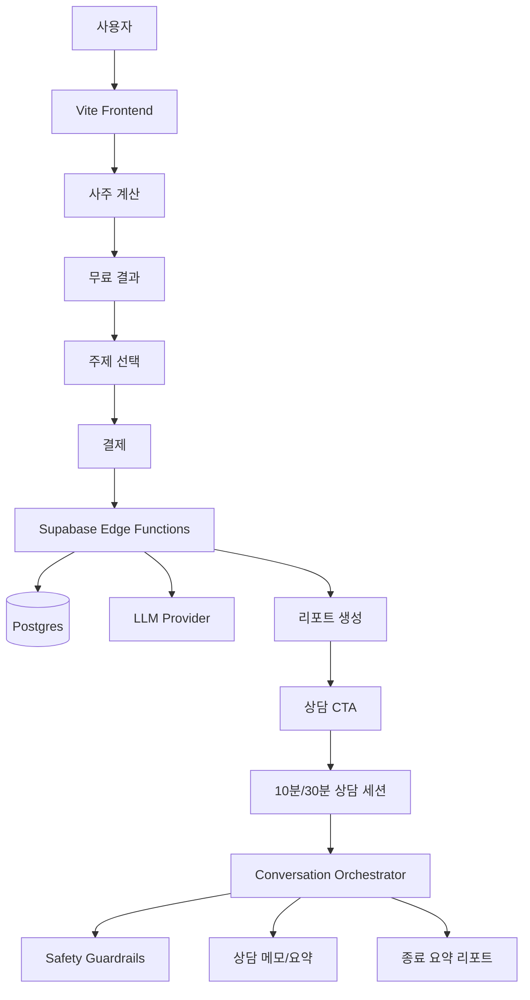

# Saajuu 수익화 마스터 플랜

작성일: 2026-07-07  
상태: Vite 정적 웹앱(v0.2.0.0), 브라우저 내 `manseryeok` 기반 사주 계산, 규칙 기반 상세 풀이, GitHub Pages 배포. 백엔드, 계정, 결제, LLM 상담 없음.

---

## 0. 핵심 결론

Saajuu는 사주 계산기가 아니라 **사주를 매개로 사용자의 고민을 받아주고 정리해주는 비임상 심리 상담형 운세 서비스**로 가야 한다.

사용자는 "내 사주가 뭔지"보다 "내가 지금 왜 이렇게 불안한지", "이 사람과 결혼해도 되는지", "사업을 시작해도 되는지", "올해 버텨도 되는지"를 묻는다. 사주는 답을 내리는 도구라기보다, 사용자가 자기 이야기를 안전하게 꺼낼 수 있게 만드는 언어다.

따라서 수익화의 중심은 아래 순서다.

1. 무료 사주 계산과 짧은 해석으로 신뢰를 만든다.
2. 궁합, 결혼운, 자녀운, 사업운, 신년운세처럼 실제 검색하고 결제하는 주제별 리포트를 판다.
3. 리포트 끝에서 10분/30분 AI 상담으로 업셀한다.
4. 상담 종료 후 요약 리포트, 다음 질문, 월간 상담권으로 반복 매출을 만든다.
5. 장기적으로 미국 시장에서는 Korean Four Pillars, K-pop archetype, fandom compatibility로 진입한다.

중요한 선은 명확하다. Saajuu는 정신과, 심리치료, 의료 상담을 대체하지 않는다. 다만 심리 상담이 가진 좋은 경험, 즉 **판단하지 않고 들어주기, 감정 이름 붙이기, 질문을 좁히기, 사용자가 자기 결론을 찾게 돕기**를 제품 톤앤매너로 차용한다.

북극성 지표는 단순 매출이 아니라 **유료 상담 완료 수 x 상담 후 명료감 점수**다. 사용자가 "맞다", "위로됐다", "내 상황이 정리됐다"라고 느껴야 재구매가 생긴다.

---

## 1. Office Hours 진단

`office-hours` 렌즈로 보면 이 사업의 질문은 "운세 앱을 만들 수 있나"가 아니다. 이미 많다. 진짜 질문은 **누가 어떤 순간에 돈을 낼 만큼 절박한가**다.

### 1.1 수요 현실

가장 강한 수요는 범용 사주풀이가 아니라 결정 직전의 불안이다.

| 상황 | 사용자의 속마음 | 결제 가능 상품 |
|------|----------------|----------------|
| 썸/연애/재회 | 이 사람이 나를 어떻게 생각할까, 다시 만날 수 있을까 | 궁합 리포트, 10분 빠른 상담 |
| 결혼 | 이 사람과 결혼해도 괜찮을까, 시기가 맞을까 | 결혼운 리포트, 30분 심층 상담 |
| 자녀/가족 | 자녀 인연, 양육 방식, 가족 갈등이 궁금하다 | 가족운 리포트, 부부 상담형 풀이 |
| 사업/창업 | 시작해도 될까, 동업자가 맞을까, 돈이 될까 | 사업운 리포트, 창업 의사결정 상담 |
| 이직/커리어 | 지금 옮겨야 하나, 나는 무슨 일이 맞나 | 커리어 리포트, 월간 운세 |
| 신년/월간 | 올해 뭐가 좋아지고 조심할 건 뭔가 | 신년운세, 월간 구독 |

첫 번째 쐐기는 **궁합과 결혼운**이다. 이유는 간단하다. 감정 강도가 높고, 상대가 있어서 이야기가 길어지고, 리포트만으로 끝나지 않는다. 상담으로 자연스럽게 이어진다.

### 1.2 상태 quo

사용자는 이미 다음 중 하나를 하고 있다.

- 네이버/유튜브/블로그에서 무료 운세를 뒤진다.
- 점신, 포스텔러, 헬로우봇 같은 앱에서 유료 콘텐츠를 산다.
- ChatGPT에 생년월일을 넣고 사주 프롬프트를 돌린다.
- 실제 점집이나 전화 상담을 찾는다.
- 친구에게 계속 같은 이야기를 한다.

Saajuu가 이기려면 "더 정확한 계산기"로는 부족하다. 사용자가 친구나 상담사에게 하듯 말할 수 있어야 한다. 그리고 답변은 점괘가 아니라 **정리된 감정, 사주 근거, 다음 행동**으로 나와야 한다.

### 1.3 가장 좁은 유료 쐐기

초기 유료 상품은 넓게 잡으면 안 된다.

**추천 MVP:**  
`궁합/결혼 고민 리포트 + 10분 AI 상담`

구성:

- 1인 또는 2인 생년월일시 입력.
- 관계 상태 선택: 썸, 연인, 부부, 재회, 결혼 준비.
- 현재 질문 선택: 연락, 결혼 가능성, 갈등 원인, 속도, 재회.
- 4,900원 리포트.
- 리포트 마지막에 9,900원 10분 상담 또는 29,000원 30분 상담 업셀.

이 상품은 작지만 강하다. 사용자가 이미 불안을 갖고 들어오고, 한 번의 리포트보다 대화가 더 자연스럽다.

### 1.4 이번 주 과제

개발 전에 해야 할 일:

1. 궁합/결혼 고민을 가진 실제 사용자 10명에게 물어본다.
2. "사주 리포트", "AI 상담", "실제 점술가 상담" 중 무엇에 돈을 낼지 확인한다.
3. 4,900원 리포트와 9,900원 10분 상담을 수동으로 팔아본다.
4. 사용자가 상담에서 반복해서 묻는 질문을 기록한다.
5. 그 질문을 리포트 템플릿과 상담 프롬프트로 만든다.

관심은 수요가 아니다. 돈을 내거나, 시간을 잡거나, 다시 물어보는 행동이 수요다.

---

## 2. CEO Review 결과

`plan-ceo-review` 관점에서 현재 계획은 좋은 방향이지만, 핵심을 더 날카롭게 줄여야 한다.

### 2.1 전제 도전

| 전제 | 판단 | 수정 |
|------|------|------|
| 사람들은 사주 전체 풀이를 원한다 | 반만 맞음 | 실제 결제는 특정 고민, 궁합, 결혼, 사업, 신년운세에서 발생 |
| AI 리포트면 충분하다 | 부족함 | 리포트는 첫 결제, 상담이 객단가와 재구매를 만든다 |
| 미국 시장은 K-pop으로 바로 간다 | 위험함 | 처음에는 K-pop archetype으로 테스트, 실제 IP는 계약 후 |
| 사주는 엔터테인먼트다 | 너무 얕음 | 사용자는 감정 정리와 자기 이해를 원한다 |
| 상담처럼 만들면 된다 | 위험함 | 의료/치료 표현 없이 비임상 정서 지원과 자기성찰로 설계해야 함 |

### 2.2 12개월 이상적 상태

```
현재
  정적 사주 계산기
  무료 규칙 기반 풀이
  결제/계정/상담 없음

이번 계획
  궁합/결혼/사업/신년 리포트
  10분/30분 AI 상담
  상담 요약 리포트
  결제와 운영 지표

12개월 이상적 상태
  Saajuu = 사주 기반 비임상 고민 상담 플랫폼
  사용자는 고민 주제를 고르고, 리포트를 받고, 상담하고, 월간으로 돌아온다
  한국은 결제 검증, 미국은 K-culture 포지션 테스트
```

### 2.3 추천 접근

세 가지 접근 중 **B를 추천**한다.

| 접근 | 설명 | 장점 | 단점 |
|------|------|------|------|
| A. 리포트 우선 | AI 리포트 단건 결제부터 구현 | 빠름, 복잡도 낮음 | 상담형 차별화가 늦다 |
| B. 주제 리포트 + 10분 상담 | 궁합/결혼 리포트와 짧은 상담을 같이 검증 | 수익화와 차별화를 동시에 검증 | 프롬프트/세션 설계가 필요 |
| C. 풀 상담 플랫폼 | 30분 상담, 구독, 관리자까지 한 번에 | 이상적인 구조 | 초기 검증 전 과투자 |

초기에는 B가 맞다. 사용자가 실제로 돈을 내는지 보면서 상담 UX를 만든다.

### 2.4 NOT in scope

- 실제 정신과 상담, 심리치료, 진단, 치료 계획.
- 자살, 자해, 폭력 위기 개입을 AI가 직접 처리하는 것.
- 허가 없는 K-pop 연예인 이름, 사진, 음성, 초상, 그룹명, 로고 사용.
- 복잡한 커뮤니티 기능.
- 처음부터 앱스토어 출시.
- 처음부터 인간 점술가 마켓플레이스 운영.

---

## 3. 경쟁 앱 BM

### 3.1 국내 경쟁

| 서비스 | BM | 강점 | Saajuu가 배울 점 | 피할 점 |
|--------|----|------|-----------------|--------|
| 점신 | 광고, 부적/상품 판매, B2B 운세 콘텐츠 공급 | 대규모 트래픽, 광고 수익, 데이터 기반 확장 | 무료 트래픽을 광고와 제휴로 보조 수익화 | 광고 중심이면 초기 매출이 약함 |
| 포스텔러 | 유료 운세 콘텐츠, 캐릭터, 테마별 콘텐츠 | 복채 문화와 유료 콘텐츠 판매를 잘 연결 | 친근한 캐릭터와 주제별 상품 구성 | 너무 넓은 콘텐츠 백화점화 |
| 헬로우봇 | 채팅형 운세, 부분 유료화, AI 챗봇, 신년/연애/재물 콘텐츠 | 대화형 UI, 감정 몰입, 긴 리포트 | 사주는 채팅형 UX와 잘 맞는다 | 챗봇이 가볍거나 장난처럼 보이면 신뢰 하락 |

국내에서 검증된 것은 명확하다. 운세는 광고만이 아니라 유료 콘텐츠가 된다. 특히 연애, 결혼, 재물, 신년운세는 반복적으로 팔린다.

### 3.2 미국/글로벌 경쟁

| 서비스 | BM | 강점 | Saajuu가 배울 점 | 빈틈 |
|--------|----|------|-----------------|------|
| Co-Star | 프리미엄 + 친구 추가/고급 차트 같은 a la carte 인앱 구매 | 강한 브랜드 보이스, 소셜 관계, 공유성 | 무료 코어와 소액 인앱 결제 조합 | 톤이 차갑고 공격적으로 느껴질 수 있음 |
| The Pattern | 자기이해, 관계, 타이밍, AI 대화형 기능 | 점성술 용어를 숨기고 심리 언어로 번역 | "운세"보다 "패턴 이해"가 미국에 먹힌다 | 한국식 사주라는 신선함은 약함 |
| Sanctuary | 구독 + 라이브 상담 + 전문 리더 | 시간 단위 상담 BM, 전문가 신뢰 | 10분/30분 상담권은 검증된 고가 상품 | 실제 전문가 운영은 비용과 품질 관리 부담 |
| Nebula | 구독, compatibility, 24/7 live chat advisors | 전환기/관계 고민을 잡는 상담형 BM | 관계와 삶의 전환 순간이 결제 타이밍 | 공격적 구독/트라이얼 인식은 신뢰를 깎음 |
| Saju World/해외 Saju 앱 | 구독형 한국 사주 풀이 | Korean fortune-telling 포지션 | 미국에도 사주 호기심은 있다 | UX와 스토리텔링이 약하면 틈새에 머묾 |

### 3.3 경쟁 BM에서 나온 결론

1. **무료 코어는 필요하다.** 무료 사주 계산과 짧은 해석이 없으면 신뢰를 만들 수 없다.
2. **돈은 주제별 고민에서 나온다.** 연애, 결혼, 관계, 사업, 신년운세가 결제 키워드다.
3. **상담은 객단가를 올린다.** Sanctuary와 Nebula가 보여주는 것은 시간 단위 상담의 힘이다.
4. **미국은 심리 언어가 중요하다.** The Pattern처럼 어려운 점성술 용어를 감정과 관계 언어로 번역해야 한다.
5. **톤은 제품이다.** Co-Star는 강한 보이스로 성공했지만, Saajuu는 차갑게 찌르는 톤보다 받아주는 톤이 맞다.
6. **신뢰를 잃는 구독은 피한다.** 무료 체험 후 자동 과금, 취소 난이도, 과도한 불안 자극은 단기 매출은 만들 수 있어도 장기 브랜드를 망친다.

Saajuu의 포지션은 이렇게 잡는다.

> The Pattern의 심리 언어 + Sanctuary의 상담형 수익화 + 헬로우봇의 채팅 몰입 + 한국 사주의 계산 근거.

---

## 4. 제품 정체성

### 4.1 한 줄 정의

Saajuu는 사주팔자를 바탕으로 사용자의 관계, 일, 돈, 가족 고민을 **판단하지 않고 받아주며 정리해주는 AI 운세 상담 서비스**다.

### 4.2 브랜드 원칙

- 무섭게 예언하지 않는다.
- 사용자의 불안을 돈으로 착취하지 않는다.
- 좋은 말만 하지 않는다.
- 사주 근거를 숨기지 않는다.
- 결론을 흐리지 않는다.
- 의료, 법률, 투자, 임신, 자살 위기에는 선을 긋는다.
- 사용자가 자기 결정을 할 수 있게 돕는다.

### 4.3 제품 언어

좋은 문장:

- "이 관계는 끌림이 강하지만, 속도와 기대치를 맞추는 대화가 중요합니다."
- "사업을 하면 무조건 성공한다기보다, 혼자 밀어붙일 때 리스크가 커지는 구조입니다."
- "지금의 불안은 방향이 없어서가 아니라, 선택지가 너무 많아 에너지가 흩어지는 쪽에 가깝습니다."
- "사주상 이런 경향이 보이지만, 최종 결정은 현실 조건과 함께 봐야 합니다."

나쁜 문장:

- "당신은 반드시 이 사람과 헤어집니다."
- "올해 창업하면 무조건 성공합니다."
- "자녀가 생깁니다."
- "당신은 우울증입니다."
- "전문가 상담은 필요 없습니다."

---

## 5. 상담 톤앤매너

사용자가 말한 핵심은 정확하다. 사주는 결국 심리 상담과 닮아 있다. 다만 Saajuu는 치료가 아니라 **심리적 수용감과 자기 이해를 제공하는 운세 상담**으로 설계한다.

### 5.1 대화 원칙

| 원칙 | 설명 | 예시 |
|------|------|------|
| 먼저 받아준다 | 바로 풀이하지 않고 감정을 반영한다 | "그 고민이면 마음이 계속 왔다 갔다 했을 것 같아요." |
| 질문을 좁힌다 | 넓은 불안을 하나의 질문으로 만든다 | "궁합 중에서도 결혼 가능성, 갈등 원인, 연락 문제 중 어디가 제일 궁금하세요?" |
| 사주 근거를 붙인다 | 감성만 말하지 않는다 | "일간과 배우자 자리의 흐름을 같이 보면..." |
| 단정하지 않는다 | 운명처럼 말하지 않는다 | "가능성이 높다"보다 "이런 패턴이 반복되기 쉽다" |
| 행동으로 끝낸다 | 위로만 하지 않는다 | "이번 주에는 이 대화를 먼저 해보세요." |
| 위기에는 멈춘다 | AI가 감당할 수 없는 주제는 전문 지원으로 연결 | "지금은 운세보다 안전이 먼저입니다." |

### 5.2 상담 응답 구조

모든 상담 답변은 아래 구조를 따른다.

1. **감정 반영**: 사용자가 느끼는 불안, 혼란, 기대를 먼저 받아준다.
2. **질문 확인**: 지금 답해야 할 질문을 한 문장으로 좁힌다.
3. **사주 근거**: 일간, 오행, 십신, 대운/세운 중 관련 근거만 설명한다.
4. **해석**: 사용자의 실제 상황에 맞게 풀어준다.
5. **선택지**: 하나의 정답이 아니라 2~3개 선택지를 보여준다.
6. **작은 행동**: 오늘 또는 이번 주에 할 수 있는 행동으로 닫는다.

### 5.3 30분 상담 진행 시나리오

```
0-3분: 입장, 감정 수용, 오늘의 질문 좁히기
3-7분: 사주 원국 중 질문과 관련된 근거만 설명
7-20분: 사용자의 맥락을 묻고 해석을 좁힘
20-25분: 선택지, 리스크, 다음 행동 정리
25-30분: 상담 요약, 후속 질문, 재상담/리포트 제안
```

### 5.4 샘플 대화

사용자: "이 사람이랑 결혼해도 될까요?"

Saajuu:

> 그 질문을 하는 상태라면 마음 한쪽에서는 이미 끌림이 있고, 다른 한쪽에서는 계속 걸리는 지점이 있는 것 같아요.  
> 먼저 결론부터 말하면, 이 관계는 감정의 끌림보다 생활 리듬과 책임 분담을 더 봐야 합니다.  
> 사주상으로는 두 분의 관계에서 처음에는 빠르게 가까워지지만, 시간이 지나면 표현 방식 차이 때문에 서운함이 쌓일 수 있는 구조가 보여요.  
> 결혼 가능성 자체보다 중요한 질문은 "이 사람이 갈등이 생겼을 때 회피하는지, 같이 조정하려는지"입니다.  
> 이번 주에는 미래 계획보다 돈, 가족, 생활 패턴에 대한 대화를 먼저 해보세요. 그 대화에서 답이 더 선명해질 가능성이 큽니다.

이 톤이 Saajuu의 핵심이다. 맞히는 것보다, 사용자가 자기 상황을 더 잘 보게 만드는 것.

---

## 6. 상품 구조

### 6.1 수익화 사다리

| 단계 | 상품 | 가격 | 목적 |
|------|------|------|------|
| 무료 | 사주 계산, 오행/십신 요약, 짧은 풀이 | 0원 | 신뢰와 유입 |
| 소액 | 주제별 미니 리포트 | 2,900~4,900원 | 첫 결제 |
| 핵심 | 궁합/결혼/사업/신년 심층 리포트 | 4,900~12,900원 | 반복 단건 매출 |
| 고가 | 10분/30분 AI 상담 | 9,900~39,000원 | 객단가 상승 |
| 반복 | 월간 상담권, 월간 운세 | 9,900~29,900원/월 | 리텐션 |
| 장기 | 인간 점술가/상담사 연결 | 수수료 20~40% | 마켓플레이스 |
| 글로벌 | 영어 리포트, K-pop archetype | $3.99~$19.99 | 미국 테스트 |

### 6.2 우선 상품

1. 궁합/결혼 리포트, 4,900원.
2. 궁합/결혼 10분 상담, 9,900원.
3. 사업운 리포트, 7,900원.
4. 신년운세 리포트, 5,900원.
5. 30분 심층 상담, 29,000원.

초기에는 이 다섯 개면 충분하다. 더 많은 상품은 데이터가 쌓인 뒤 늘린다.

### 6.3 주제별 리포트 포맷

공통 구조:

1. 한 줄 결론.
2. 현재 고민 요약.
3. 사주 근거 3개.
4. 좋은 흐름.
5. 조심할 패턴.
6. 현실 체크리스트.
7. 이번 주 행동.
8. 상담으로 더 풀 질문 3개.

궁합/결혼:

- 끌림 포인트.
- 부딪히는 지점.
- 결혼 생활에서 중요한 조건.
- 대화법.
- 상대에게 확인해야 할 질문.

사업운:

- 돈 버는 방식.
- 혼자/동업 적합성.
- 잘 맞는 역할.
- 사업 리스크.
- 30일 검증 행동.

자녀운/가족운:

- 가족관.
- 돌봄 방식.
- 부모 역할 강점.
- 소통 주의점.
- 임신/출산 예측은 하지 않음.

---

## 7. 아키텍처

### 7.1 목표 구조



### 7.2 핵심 컴포넌트

| 컴포넌트 | 역할 |
|----------|------|
| Product Catalog | 리포트/상담/구독 상품 정의 |
| Topic Template Engine | 궁합, 결혼, 사업 등 주제별 리포트 구조 |
| Prompt Registry | 프롬프트 버전 관리 |
| Conversation Orchestrator | 상담 단계, 톤, 질문 좁히기 제어 |
| Tone Policy | 받아주는 말투, 금지 표현, 응답 길이 |
| Safety Guardrails | 자해, 의료, 투자, 임신, 법률 등 고위험 주제 감지 |
| Session Timer | 10분/30분 상담 시간 관리 |
| Summary Generator | 상담 종료 요약 리포트 |
| Analytics | 전환율, 상담 완료율, 환불률, 명료감 점수 |

### 7.3 데이터 모델 초안

`orders`

- `id`
- `product_code`
- `amount`
- `currency`
- `provider`
- `status`
- `email`
- `created_at`

`birth_inputs`

- `id`
- `order_id`
- `calendar_type`
- `birth_date`
- `birth_hour`
- `birth_minute`
- `is_leap_month`
- `retention_policy`

`reports`

- `id`
- `order_id`
- `topic`
- `status`
- `chart_json`
- `prompt_version`
- `content_md`
- `access_token_hash`
- `expires_at`

`consultation_sessions`

- `id`
- `order_id`
- `topic`
- `status`
- `duration_minutes`
- `started_at`
- `ended_at`
- `context_summary`
- `final_summary_md`
- `safety_flags`

`consultation_messages`

- `id`
- `session_id`
- `role`
- `content`
- `safety_label`
- `created_at`

---

## 8. 안전과 신뢰

이 제품은 심리 상담처럼 느껴질 수 있다. 그래서 더 조심해야 한다.

### 8.1 금지 포지션

- 정신과 상담 대체.
- 심리치료.
- 우울증, 불안장애 등 진단.
- 약물, 치료, 병원 방문 여부 조언.
- 자살/자해 위기 상담을 AI가 끝까지 맡는 것.
- 임신, 출산, 건강, 투자 결과 예측.

### 8.2 위기 대응

한국 사용자:

- 자살/자해 위험 신호가 감지되면 상담을 중단하고 109 자살예방 상담전화, 112/119 등 즉시 도움을 안내한다.

미국 사용자:

- 988 Suicide & Crisis Lifeline을 안내한다. 전화, 문자, 채팅이 가능하고 24/7 지원된다.

서비스 응답 원칙:

1. 운세 풀이를 멈춘다.
2. 사용자의 안전을 우선한다고 말한다.
3. 즉시 연락 가능한 공식 지원 번호를 보여준다.
4. 계속 상담을 이어가며 의존시키지 않는다.

### 8.3 개인정보 원칙

- 생년월일시는 민감하게 취급한다.
- 상담 내용은 더 민감하다.
- 광고 픽셀, 리타겟팅, 제3자 마케팅 전송은 상담 페이지에서 금지한다.
- 미국에서 health/wellness로 해석될 수 있는 기능은 FTC, FDA, 주법 리스크를 검토한다.
- 기본값은 최소 보관, 명시 동의, 삭제 가능이어야 한다.

---

## 9. 단계별 실행 계획

### Phase 0: 수요 검증, 1주

목표: 코드를 많이 쓰기 전에 돈 낼 질문을 찾는다.

작업:

- 궁합/결혼 고민 사용자 10명 인터뷰.
- 4,900원 리포트 샘플 3개 작성.
- 9,900원 10분 상담을 수동 판매 테스트.
- 상담 질문 로그 정리.
- "상담 후 명료감" 1~5점 설문.

성공 기준:

- 10명 중 3명 이상이 실제 결제 또는 결제 의사.
- 반복 질문 5개 이상 발견.
- 샘플 리포트 만족도 4/5 이상.

### Phase 1: 주제 리포트 MVP, 2~4주

목표: 첫 자동 결제를 만든다.

작업:

- 토스페이먼츠 테스트 결제.
- Supabase Edge Functions.
- 궁합/결혼 리포트 생성.
- 리포트 열람 링크.
- 이메일 전달.
- 환불/문의/약관/개인정보 문구.

성공 기준:

- 유료 리포트 월 50건.
- 결제 완료 후 생성 성공률 98% 이상.
- 환불률 5% 이하.

### Phase 2: 10분 상담 MVP, 4~6주

목표: 리포트 구매자를 상담으로 전환한다.

작업:

- 상담 주제 선택.
- 10분 세션 타이머.
- Conversation Orchestrator.
- Tone Policy.
- 상담 요약 리포트.
- 안전 가드레일.

성공 기준:

- 리포트 구매자 중 상담 전환율 5% 이상.
- 상담 완료율 80% 이상.
- 상담 후 명료감 4/5 이상.

### Phase 3: 30분 심층 상담과 패키지, 6~10주

목표: 객단가를 올린다.

상품:

- 궁합 리포트 + 30분 상담.
- 결혼운 리포트 + 30분 상담.
- 사업운 리포트 + 30분 상담.
- 신년운세 + 30분 상담.

성공 기준:

- 상담 구매자 중 20% 이상 재구매.
- 패키지 평균 객단가 39,000원 이상.
- 상담 환불률 7% 이하.

### Phase 4: 신년운세 성수기, 11월 전 완성

목표: 12월~2월 성수기 매출을 잡는다.

작업:

- 2027 신년운세 랜딩.
- 월별 운세 리포트.
- 궁합 + 신년 관계 흐름.
- 사업운 + 내년 돈 흐름.
- 공유 카드.
- 광고/SEO 콘텐츠.

### Phase 5: 미국 K-culture 베타

목표: 미국에서 사주를 K-culture 자기이해 콘텐츠로 테스트한다.

상품:

- Korean Four Pillars Personality Report.
- K-pop Stage Persona.
- Bias Compatibility Archetype.
- Relationship Rhythm Reading.

원칙:

- 실제 연예인 이름, 사진, 목소리, 그룹명은 허가 없이 사용하지 않는다.
- 팬덤명, 로고, 가사도 상업 상품에 무단 사용하지 않는다.
- 먼저 일반화된 archetype으로 수요를 확인한다.
- 지표가 나오면 크리에이터/소형 기획사 제휴를 검토한다.

---

## 10. 가격과 수익 추정

### 10.1 국내 가격

| 상품 | 가격 |
|------|------|
| 미니 리포트 | 2,900원 |
| 궁합/결혼 리포트 | 4,900~7,900원 |
| 사업운 리포트 | 7,900~12,900원 |
| 10분 상담 | 9,900원 |
| 30분 상담 | 29,000~39,000원 |
| 신년운세 + 30분 상담 | 49,000~79,000원 |

### 10.2 간단 시나리오

월 방문자 10,000명:

- 무료 풀이 완료율 40% = 4,000명.
- 리포트 구매율 2% = 200건.
- 리포트 평균가 5,900원 = 118만 원.
- 리포트 구매자 중 상담 전환 5% = 10건.
- 상담 평균가 29,000원 = 29만 원.
- 월 매출 약 147만 원.

월 방문자 50,000명:

- 무료 풀이 완료 20,000명.
- 리포트 구매 1,000건.
- 리포트 매출 590만 원.
- 상담 50건.
- 상담 매출 145만 원.
- 월 매출 약 735만 원.

상담 전환율이 10%가 되면 구조가 바뀐다. 리포트는 퍼널이고, 상담이 핵심 이익원이 된다.

---

## 11. 운영 지표

핵심 지표:

- 무료 풀이 완료율.
- 주제 상품 클릭률.
- 리포트 결제율.
- 상담 CTA 클릭률.
- 상담 전환율.
- 상담 완료율.
- 상담 후 명료감 점수.
- 상담 요약 리포트 열람률.
- 재구매율.
- 환불률.
- 위기 감지 후 안전 전환 성공률.

초기 목표:

- 무료 풀이 완료율 40% 이상.
- 리포트 결제율 1~2%.
- 상담 전환율 5%.
- 상담 후 명료감 4/5 이상.
- 환불률 5~7% 이하.

---

## 12. 실패 모드

| 실패 | 이유 | 대응 |
|------|------|------|
| 그냥 운세 앱처럼 보임 | 차별화 없음 | 상담형 톤과 주제별 고민 중심으로 재정의 |
| AI 챗봇처럼 가볍게 느껴짐 | 세션 경험 없음 | 타이머, 상담 메모, 종료 요약으로 유료 상담 경험 만들기 |
| 너무 치료처럼 보임 | 규제/신뢰 리스크 | 비임상 자기성찰, 운세 엔터테인먼트, 위기 라우팅 명확화 |
| 답변이 너무 단정적임 | 불안 조장 | 금지 표현, 사주 근거, 선택지 제시 |
| 리포트만 팔리고 재구매 없음 | 일회성 상품 | 상담 CTA, 월간 운세, 후속 질문권 |
| 경쟁 앱에 묻힘 | 포지션 약함 | Korean saju + 상담 톤 + 근거 기반 해석 |
| 미국 IP 리스크 | K-pop 무단 사용 | archetype 먼저, 공식 제휴 전 실명/IP 금지 |

---

## 13. 바로 다음 작업

### 이번 주

- [ ] 궁합/결혼 고민 사용자 10명 인터뷰.
- [ ] 궁합/결혼 리포트 샘플 3개 작성.
- [ ] 10분 상담 대화 스크립트 3개 작성.
- [ ] Tone Policy v1 작성.
- [ ] 금지 표현/위기 대응 문구 작성.

### 2주 내

- [ ] 궁합/결혼 랜딩 페이지 초안.
- [ ] 프리미엄 클릭 이벤트 추가.
- [ ] 수동 결제 또는 간단 결제 테스트.
- [ ] 상담 후 명료감 설문 만들기.
- [ ] 사업운 리포트 샘플 1개 작성.

### 1개월 내

- [ ] 토스페이먼츠 테스트 결제.
- [ ] Supabase Edge Function 리포트 생성 PoC.
- [ ] 리포트 열람 페이지.
- [ ] 10분 상담 세션 PoC.
- [ ] 상담 요약 리포트 자동 생성.

### 3개월 내

- [ ] 궁합/결혼 리포트 정식 출시.
- [ ] 10분 상담 출시.
- [ ] 30분 상담 베타.
- [ ] 신년운세 상품 준비.
- [ ] 미국 K-pop archetype 랜딩 테스트.

---

## 14. 참고 자료

- [Co-Star FAQ](https://www.costarastrology.com/faq)
- [The Pattern](https://www.thepattern.com/)
- [Sanctuary App Store](https://apps.apple.com/us/app/sanctuary-psychic-reading/id1417411962)
- [Nebula App Store](https://apps.apple.com/us/app/nebula-spiritual-guidance/id1459969523)
- [헬로우봇 Google Play](https://play.google.com/store/apps/details?hl=ko&id=com.thingsflow.hellobot)
- [유니콘팩토리 - 점신/포스텔러 BM](https://www.unicornfactory.co.kr/article/2025012414570018707)
- [ZDNet - 포스텔러 인터뷰](https://zdnet.co.kr/view/?no=20250203104315)
- [FTC Mobile Health App Interactive Tool](https://www.ftc.gov/business-guidance/resources/mobile-health-apps-interactive-tool)
- [988 Suicide & Crisis Lifeline](https://988lifeline.org/)
- [보건복지부 - 자살예방 상담전화 109](https://www.mohw.go.kr/board.es?act=view&bid=0027&list_no=1487674&mid=a10503010100&nPage=1&tag=)
